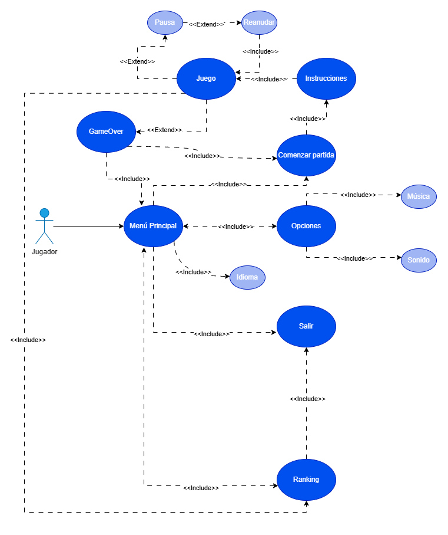
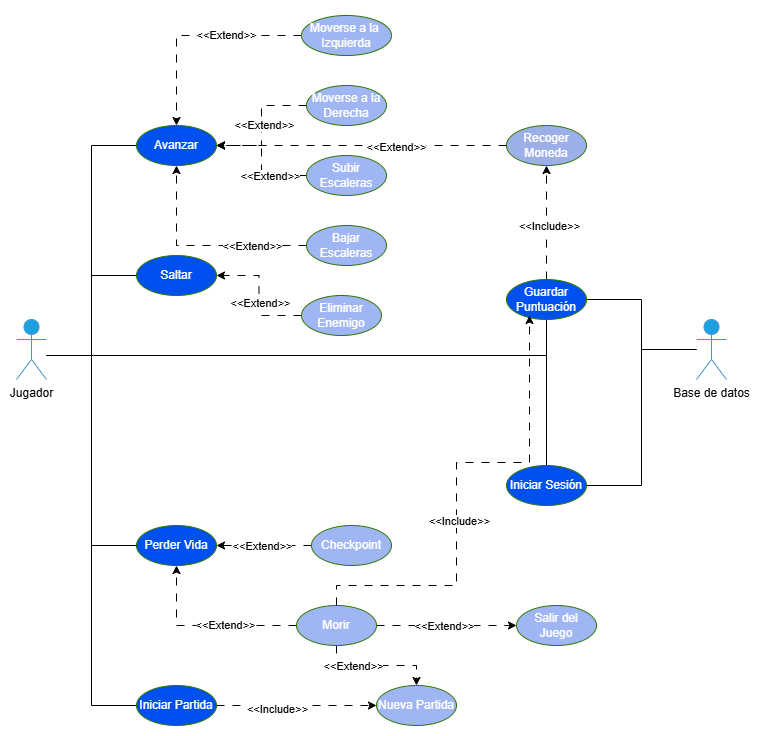

# FASE DE DISEÑO

Este documento resume la información del proyecto. El Documento de Diseño y el Manual Técnico, especialmente este último, proporcionan información más completa.

## DIAGRAMAS CASOS DE USO

### Menú

El Menú Principal del juego actúa como el punto central de control para el jugador. Desde este menú, se puede iniciar una nueva partida, lo que lleva al jugador a las instrucciones del juego antes de comenzar la partida propiamente dicha. También se puede salir del juego, consultar el ranking de puntuaciones, cambiar el idioma de la interfaz del juego o acceder a las opciones de configuración. Dentro de las opciones, el jugador puede ajustar el volumen de la música, activarla o desactivarla, y configurar los efectos de sonido del juego. Durante la partida, el jugador que utiliza la versión de Windows puede pausar el juego, lo que detendrá el juego y mostrará un mensaje de "Pausa" en pantalla, y luego reanudar el juego. Esta funcionalidad de pausa no está disponible en la versión del juego para Android. Al finalizar una partida, el jugador es dirigido al ranking de puntuaciones para comparar su desempeño. Si se llega a un Game Over, el jugador puede optar por volver al Menú Principal o comenzar una nueva partida

### Juego: in-game

El diagrama de caso de uso del juego muestra las interacciones entre el jugador y el sistema de juego, detallando cómo el jugador puede avanzar en el juego, interactuar con diferentes elementos y cómo el sistema gestiona estas acciones.
El jugador puede avanzar en el juego moviéndose a la izquierda o a la derecha dentro del entorno del juego, además de subir y bajar escaleras para acceder a diferentes niveles o áreas. También tiene la capacidad de saltar para eliminar enemigos, una mecánica común en muchos juegos de plataformas.

Al recoger monedas, el sistema actualiza automáticamente la puntuación del jugador, reflejando su progreso. En caso de que el jugador pierda una vida, puede reiniciar desde un punto de control previamente establecido, manteniendo parte de su progreso.

Si el jugador pierde todas sus vidas, se activa el estado de "Morir". En este estado, la puntuación del jugador se guarda en una base de datos. El jugador entonces tiene dos opciones: "Salir del Juego" o "Comenzar Nueva Partida", lo que reinicia el juego y elimina el progreso de la partida anterior

Además de las interacciones del jugador, el sistema incluye una conexión con la base de datos para almacenar las puntuaciones del jugador. Esto requiere que el jugador inicie sesión para asegurar que los datos se guardan correctamente.

## DIAGRAMAS DE NAVEGACIÓN Y FLUJO

En el sigueinte diagrama se detalla el flujo de navegación en el juego, desde la primera pantalla del juego hasta la última.

## DISEÑO DE LA INTERFAZ

El diseño de las interfaces en nuestro juego tiene como meta principal presentar toda la información relevante al jugador de manera clara y accesible. Nos esforzamos por mantener una coherencia estética con el estilo visual del juego, utilizando una paleta de colores armoniosa, fondos simples y tipografías fáciles de leer, de modo que tanto los menús como la interfaz en pantalla (HUD) sean intuitivos y funcionales.

### Pantalla de Login, Menú Principal y Opciones

La primera pantalla que encontramos al iniciar la aplicación es la pantalla de inicio de sesión. Esta pantalla no solo introduce al usuario al entorno del juego, sino que también establece la coherencia estética y temática del mismo. Presenta un título que indica "Login", y un fondo que es utilizado de forma consistente en todos los niveles. En esta pantalla, también se puede ver al dinosaurio característico del juego, que aparece parcialmente escondido, y un terreno que complementa la ambientación.

Para acceder al juego, el usuario debe ingresar su correo electrónico y contraseña en los campos correspondientes. Una vez completados estos campos, el usuario puede presionar el botón de "Login", el cual lo autentica o registra. Tras una autenticación exitosa, el usuario es dirigido automáticamente al menú principal de la aplicación.

En el menú principal encontramos las diferentes opciones:

- Comenzar: seleccionamos estas opción para comenzar una nueva partida
- Opciones: esta opción nos llevará  a la pantalla de opciones donde podemos realizar diversas configuraciones.
- Ranking: nos llevará a la pantalla del ranking y de los créditos del juego.
- Salir: con esta opción saldremos del juego.
- Banderas: también podemos elegir idiomas del juego seleccionando una de las banderas (castellano, gallego o inglés)

Esta sería la pantalla de opciones en la que podemos elegir las configuraciones del juego, como el volumen de la música de fondo y los sonidos, luego volveremos al menú principal con la opción de back.

### Instrucciones

Después de elegir la opción de comenzar en el menú principal, la siguiente interfaz es una pantalla de instrucciones que proporciona toda la información necesaria para que los jugadores comprendan el objetivo, las mecánicas y los controles del juego. El fondo de la pantalla muestra un paisaje montañoso con tonos azules, creando una atmósfera coherente con el resto del juego.

### HUD

La HUD (Heads Up-Display) de nuestro juego es clara y concisa, asegurando que el jugador tenga siempre la información esencial al alcance de la vista durante la interacción. El jugador necesita conocer en todo momento su nivel de vida y la cantidad de monedas recogidas.

El nivel de vida se muestra con una barra de salud y un icono de corazón, indicando el estado de salud del personaje. Este icono se sitúa en la esquina superior izquierda de la pantalla. La cantidad de monedas recogidas se muestra en la esquina superior derecha, junto a un icono de moneda, que indica el número total de monedas obtenidas hasta el momento.

En cuanto a la HUD en la versión de Android, además de mostrar la información esencial como el nivel de vida, la cantidad de monedas recogidas y cualquier ítem especial, se incluyen botones virtuales que facilitan la navegación y la interacción del jugador. Estos botones virtuales están ubicados en la parte inferior de la pantalla, con flechas hacia la izquierda, derecha y abajo a la izquierda, y un gran botón rojo a la derecha.

Este diseño garantiza que el jugador tenga acceso inmediato a la información más relevante, manteniendo una coherencia estética con el resto del juego y facilitando la navegación y la interacción dentro del mismo.

### Otras interfaces

Esta pantalla sólo está disponible en la versión de Windows del juego y proporciona una interfaz clara y directa para indicar al jugador que el juego está temporalmente detenido. Esta pantalla, que se activa únicamente en la versión de Windows, muestra un mensaje central que dice "PAUSADO PRESIONA P PARA CONTINUAR", guiando al jugador sobre cómo reanudar el juego.

Durante el estado de pausa, el fondo del juego permanece visible, mostrando el dinosaurio del personaje en su posición actual, los elementos del entorno como monedas y flores, y la HUD (que incluye el icono de corazón indicando la salud y el contador de monedas) todavía visible. Esta pausa permite al jugador tomar un descanso sin perder de vista su progreso y posición en el juego.

Al presionar la tecla P en el teclado, el juego se reanuda inmediatamente, permitiendo al jugador continuar desde el punto exacto donde se detuvo.

### Game Over

En la versión de Windows de nuestro juego, la pantalla de "Game Over" proporciona una clara indicación al jugador de que la partida ha terminado. Esta pantalla sigue manteniendo la coherencia estética del juego.
En el centro de la pantalla, se presenta el mensaje "FIN DEL JUEGO", acompañado de instrucciones claras para el jugador que lo guía para que, tras la derrota, pueda elegir entre reiniciar la partida desde el principio o regresar al menú principal del juego.

En la version de Android tenemos la misma interfaz, salvo por los botones para que el jugador pueda elegir entre reiniciar la partida desde el principio o regresar al menú principal del juego.

### Ranking y Créditos

La última pantalla del juego es la del Ranking que muestra las puntuaciones más altas de los jugadores, creando un sentido de competencia y logro. Esta pantalla tiene un fondo azul adornado con estrellas y colinas verdes en la parte inferior, destacando el ambiente del juego.
En la parte superior, se encuentra el título "RANKING" y debajo de él, hay dos columnas etiquetadas como "PLAYERID" y "SCORE", cada una mostrando los identificadores de los jugadores y sus respectivas puntuaciones.
También se destaca un pequeño dinosaurio escondido entre los arbustos y en la parte inferior de la pantalla, se encuentra los créditos, mencionando a los diseñadores y colaboradores musicales del juego.

## Diagrama de Base de Datos

El sistema del juego utiliza una base de datos para almacenar la información de los usuarios y sus puntuaciones. Esta base de datos se estructura en dos tablas principales:

- **Tabla Usuarios**: Esta tabla almacena la información de inicio de sesión de los usuarios:
  - *email*: Este campo almacena la dirección de correo electrónico del usuario y actúa como la clave primaria de la tabla.
  - *password*: Este campo almacena la contraseña asociada a la cuenta del usuario.
- **Tabla Ranking**: Esta tabla almacena las puntuaciones de los jugadores y las vincula con sus respectivas cuentas de usuario:
  - *PlayerId*: Este campo es una clave foránea que se relaciona con el campo "email" de la tabla "Usuarios", estableciendo un vínculo entre los datos del usuario y su puntuación.
  - *score*: Este campo almacena la puntuación del jugador.

Las tablas **Usuarios** y **Ranking** se relacionan mediante una relación de uno a uno (1:1), lo que significa que cada usuario tiene una única entrada en el ranking y viceversa. Esta relación asegura un seguimiento preciso de las puntuaciones de cada usuario.
La utilización de esta estructura de base de datos es esencial para el correcto funcionamiento del sistema de juego, ya que permite:

- **Autenticación de usuarios**: La tabla *Usuarios* pemite verificar la identidad de los jugadores al iniciar sesión.

- **Almacenamiento de puntuaciones**: La tabla *Ranking* guarda las puntuaciones obtenidas por los jugadores, lo que permite mostrarlas en el ranking del juego.

- **Vinculación de puntuaciones con usuarios**: La relación 1:1 entre las tablas asegura que cada puntuación esté asociada al usuario correcto. Esto permite una comparación justa entre jugadores y evita la duplicación de entradas en el ranking.

- **Mantenimiento de la integridad y coherencia de datos**: La estructura de la base de datos contribuye a la organización y correcta gestión de la información del juego.

En resumen, el diagrama de base de datos ilustra una estructura eficiente para gestionar la información de los usuarios y sus puntuaciones, garantizando la seguridad y la precisión en el almacenamiento de datos dentro del sistema del juego.

## Diagrama de componentes software y de despliegue

El diagrama de componentes ilustra cómo las diferentes partes del sistema interactúan entre sí, desde la interfaz de usuario hasta los servicios backend, pasando por los módulos de lógica del juego. Este diseño modular facilita la separación de responsabilidades, garantizando un mantenimiento eficiente, escalabilidad del sistema y una experiencia de usuario consistente.

El sistema está dividido en tres paquetes principales: **Interfaz de Usuario (User Interface)**, **Módulos de Lógica del Juego (Game Logic Modules)** y **Servicios Backend (Backend Service)**. Cada uno de estos paquetes desempeña un rol esencial en la arquitectura del juego y colabora con los demás para proporcionar una experiencia fluida y funcional.

### Interfaz de Usuario (User Interface)

Este paquete agrupa los componentes que interactúan directamente con el usuario, como las pantallas y elementos visuales. Incluye la *Login Screen*, donde los jugadores ingresan sus credenciales, y el *Main Menu*, que ofrece opciones para iniciar el juego, configurar ajustes, consultar el ranking o salir. Otros componentes relevantes son la *Options Menu*, donde el jugador personaliza su experiencia; la *Instructions Screen*, que explica las mecánicas del juego y el *Ranking Screen*, que muestra las puntuaciones más altas. Durante el juego, la *HUD* proporciona información clave como la salud y las monedas recolectadas, mientras que la *Game Over Screen* aparece al finalizar una partida.

Estos componentes se conectan con los módulos de lógica del juego para enviar solicitudes y recibir datos procesados, garantizando una interacción dinámica y en tiempo real.

### Módulos de Lógica del Juego (Game Logic Modules)

Aquí se concentra la lógica que respalda las funcionalidades principales del juego. Por ejemplo, cuando un usuario inicia sesión, la *Login Screen* interactúa con el **Authentication Module**, que verifica las credenciales del usuario mediante **Firebase Authentication**. De manera similar, el *Score Management* se encarga de calcular y gestionar las puntuaciones durante el juego, mientras que el *Score Saving Module* las almacena de forma permanente en el backend.

Estos módulos actúan como intermediarios entre la interfaz de usuario y los servicios backend, asegurando que los datos fluyan de manera eficiente y precisa.

### Servicios Backend (Backend Service)

Este paquete incluye los componentes que ofrecen soporte en la nube, específicamente los servicios de Firebase. **Firebase Authentication** se encarga de autenticar a los usuarios, mientras que **Firebase Firestore** almacena datos en tiempo real, como puntuaciones. Además, el archivo **google-services.json** conecta la aplicación cliente con los servicios de Firebase, facilitando una integración fluida.

### Comunicación entre Componentes

Los paquetes están interconectados para garantizar el flujo de datos. Por ejemplo, durante el inicio de sesión, la *Login Screen* llama al *Authentication Module*, que valida las credenciales a través de Firebase Authentication. En el juego, la *Gameplay* envía información al *Score Management*, que, tras procesar las puntuaciones, las guarda mediante **Firebase Firestore**. Esta interacción asegura que los datos estén sincronizados entre el cliente y el servidor.

En conjunto, este diseño modular permite una clara organización del sistema, con cada componente cumpliendo una función específica y colaborando con los demás para crear un juego dinámico, escalable y de fácil mantenimiento.

El diagrama de despliegue muestra cómo se estructura la arquitectura del sistema para garantizar una interacción fluida entre el jugador, la aplicación del juego y el backend. La aplicación se ejecuta en dispositivos Android o Windows, representados como **Gaming Device**, y está conectada a un backend basado en **Firebase**.

En el dispositivo del jugador se encuentra la **Game Application**, la cual utiliza el *Firebase SDK* para manejar el inicio de sesión de los usuarios y sincronizar datos como puntuaciones en tiempo real con la base de datos en la nube. La integración con Firebase se configura mediante el archivo **google-services.json**, que conecta el cliente con los servicios backend.

El usuario interactúa con la aplicación a través de un teclado (en Windows) o una pantalla táctil (en Android), lo que le permite ingresar datos y controlar el juego. Por su parte, el backend de Firebase, accesible a través del protocolo HTTPS, se encarga de la autenticación y del almacenamiento de datos clave del juego.

La comunicación entre el cliente y el backend es segura y encriptada, utilizando el *Firebase SDK* como intermediario. Este diseño no solo garantiza la seguridad y confiabilidad de los datos, sino que también permite una experiencia optimizada y uniforme para los jugadores en ambas plataformas. La elección de Firebase como backend asegura escalabilidad y mantenimiento simplificado, al delegar las operaciones más complejas al entorno en la nube.
