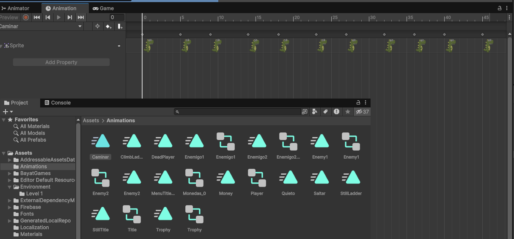
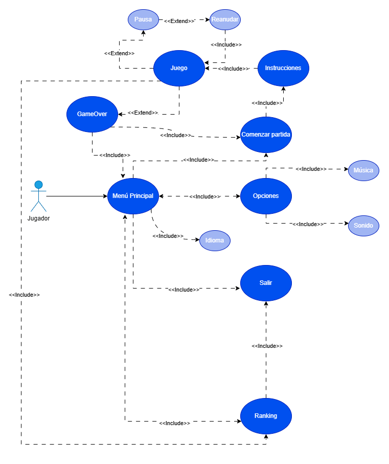

# MANUAL TÉCNICO

Creado por: Nerea Trillo Pérez

Versión del documento: 1.4

## HISTORIAL DE REVISIONES

| Versión | Fecha | Comentarios |
| --- | --- | --- |
| 1.0 | 06-12-2024 | Estructura del documento |
| 1.1 | 07-12-2024 | Incorporación del índice y contenido introducción y arquitectura |
| 1.2 | 08-12-2024 | Actualización de contenido puntos 3 y 4 |
| 1.3 | 09-12-2024 | Actualización de contenido puntos 5, 6 y 7 |
| 1.3 | 10-12-2024 | Actualización de contenido puntos 8 y 9 |
| 1.4 | 11-12-2024 | Manual completo. |

## Índice

1. [**Introducción**](#1-introducción)
   - [1.1 Propósito y objetivo del manual](#11-propósito-y-objetivo-del-manual)
   - [1.2 Visión general del juego](#12-visión-general-del-juego)

2. [**Arquitectura del Juego**](#2-arquitectura-del-juego)
   - [2.1 Estructura del mundo del juego](#21-estructura-del-mundo-del-juego)
   - [2.2 Mecánicas clave del juego](#22-mecánicas-clave-del-juego)

3. [**Motor y Tecnologías Utilizadas**](#3-motor-y-tecnologías-utilizadas)
   - [3.1 Descripción del motor de juego empleado](#31-descripción-del-motor-de-juego-empleado)
   - [3.2 Herramientas de desarrollo aplicadas](#32-herramientas-de-desarrollo-aplicadas)
   - [3.3 Tecnologías de renderizado y gráficos](#33-tecnologías-de-renderizado-y-gráficos)
     - [3.3.1 Creación de sprites](#331-creación-de-sprites)
     - [3.3.2 Importación y manejo de assets gráficos en Unity (GAmeObjects)](#332-importación-y-manejo-de-assets-gráficos-en-unity-gameobjects)
       - [3.3.2.1 Consideraciones generales](#3321-consideraciones-generales)
       - [3.3.2.2 Personaje y enemigos](#3322-personaje-y-enemigos)
       - [3.3.2.3 Tilesets y Tilemaps](#3323-tilesets-y-tilemaps)
       - [3.3.2.4 Elementos decorativos](#3324-elementos-decorativos)
     - [3.3.3 Prefabs](#333-prefabs)
     - [3.3.4 Animaciones: Animator y Animation](#334-animaciones-animator-y-animation)
     - [3.3.5 Cámaras y Cinemachine](#335-cámaras-y-cinemachine)
     - [3.3.6 Efecto Parallax](#336-efecto-parallax)
   - [3.4 Audio y música en el juego](#34-audio-y-música-en-el-juego)

4. [**Algoritmos y Lógica del Juego**](#4-algoritmos-y-lógica-del-juego)
   - [4.1 Controlador del juego (Game Manager)](#41-controlador-del-juego-game-manager)
   - [4.2 Inteligencia artificial para enemigos](#42-inteligencia-artificial-para-enemigos)
   - [4.3 Sistemas de colisiones y físicas](#43-sistemas-de-colisiones-y-físicas)
   - [4.4 Sistema de vida y muerte del jugador](#44-sistema-de-vida-y-muerte-del-jugador)

5. [**Interfaz de Usuario y Controles**](#5-interfaz-de-usuario-y-controles)
   - [5.1 Diseño y desarrollo de la interfaz de usuario](#51-diseño-y-desarrollo-de-la-interfaz-de-usuario)
     - [5.1.1 Implementación en Unity](#511-implementación-en-unity)
   - [5.2 Menú](#52-menú)
     - [5.2.1 Pantalla de inicio de sesión y menú principal](#521-pantalla-de-inicio-de-sesión-y-menú-principal)
     - [5.2.2 Menú de opciones](#522-menú-de-opciones)
   - [5.3 HUD](#53-hud)
   - [5.4 Pantalla de instrucciones](#54-pantalla-de-instrucciones)
   - [5.5 Otras interfaces](#55-otras-interfaces)
     - [5.5.1 Pantalla de fin de juego (Game Over)](#551-pantalla-de-fin-de-juego-game-over)
     - [5.5.2 Créditos](#552-créditosranking)
     - [5.5.3 HUD para Android](#553-hud-para-android)
   - [5.6 Selección de idioma e implementación multilingüe en Unity](#56-selección-de-idioma-e-implementación-multilingüe-en-unity)

6. [**Controles**](#6-controles)

7. [**Sistema de Guardado de Usuario y Tabla de Clasificación**](#7-sistema-de-guardado-de-usuario-y-tabla-de-clasificación)
   - [7.1 Mecanismo de guardado del usuario](#71-mecanismo-de-guardado-del-usuario-y-puntuación)
   - [7.2 Carga y visualización de la tabla de clasificación](#72-carga-y-visualización-de-la-tabla-de-clasificación)

8. [**Optimización y Rendimiento**](#8-optimización-y-rendimiento)
   - [8.1 Requisitos del sistema](#81-requisitos-del-sistema)
   - [8.2 Mantenimiento del sistema](#82-mantenimiento-del-sistema)
   - [8.3 Pruebas y validación](#83-pruebas-y-validación)

9. [**Referencias y Documentación Adicional**](#9-referencias-y-documentación-adicional)
   - [9.1 Recursos, documentación y librerías utilizadas](#91-recursos-documentación-y-librerías-utilizadas)
   - [9.2 Créditos y agradecimientos](#92-créditos-y-agradecimientos)

## 1. Introducción

### 1.1 Propósito y objetivo del manual

El objetivo de este manual es proporcionar una comprensión profunda de la arquitectura, estructura y funcionamiento interno del juego desde una perspectiva técnica. Está dirigido tanto a desarrolladores como a cualquier persona interesada en el núcleo de este proyecto. Este documento ofrece una guía detallada sobre todos los aspectos técnicos y fundamentales del juego: programación, gráficos, mecánicas, algoritmos, y más. Su finalidad es documentar de la manera más precisa posible todo el proceso de creación y los contenidos del juego, sirviendo tanto para futuras mejoras como para conservar la memoria del proyecto. Para facilitar una mejor comprensión del manual técnico, se recomienda leer primero el Game Design Document (GDD), que ofrece una presentación completa de la narrativa y el diseño del juego.

### 1.2 Visión general del juego

Dinosaurio: La Aventura de las Monedas Perdidas es un emocionante juego de aventuras en 2D disponible para Windows y Android. Desarrollado en Unity utilizando C#, este juego de plataformas te pone en la piel de un intrépido dinosaurio.

El jugador recorrerá diversos y coloridos escenarios, sorteando obstáculos y enfrentándose a criaturas que dificultarán su camino, con el objetivo de recolectar la mayor cantidad posible de monedas y así aumentar su puntuación. La estructura del juego se compone de múltiples niveles, cada uno con desafíos únicos que el jugador deberá superar para avanzar en su aventura.

## 2. Arquitectura del Juego

### 2.1 Estructura del mundo del juego

En Dinosaurio: La Aventura de las Monedas Perdidas podemos encontrar diversos escenarios diseñados para desafiar al jugador con trampas, enemigos y la recolección de monedas.En general, la estructura que más se repite a lo largo de los niveles es la siguiente:

El nivel suele comenzar con una pantalla en negro que muestra el número del nivel en el que se está. Esta pantalla se desvanece y revela el escenario del nivel.

A continuación de esta presentación, viene la parte de acción. La jugabilidad principal incluye la navegación por diferentes escenarios, sorteando obstáculos y enfrentándose a enemigos. Aquí, el jugador deberá avanzar recogiendo monedas y evitando trampas.

La conexión entre escenas se realiza a través de colliders. Cuando el personaje del jugador toca un objeto invisible (el cual está al final de cada nivel), se activa el collider y el SceneManager carga la nueva escena, permitiendo una transición fluida entre los niveles.

A nivel de organización de escenas en Unity, cada nivel está conformado por una única escena que incluye todos los elementos del juego, como trampas, enemigos y monedas. Esto simplifica la estructura del juego y mantiene la coherencia en la experiencia del jugador.

A continuación se muestra un script con el código para la transición de un nivel a otro. Esta transición ocurre cuando el jugador entra en contacto con un objeto en la escena que actúa como collider. La carga de las escenas se lleva a cabo con el SceneManager, La carga de las escenas se lleva a cabo con el SceneManager, pero primero se llama al método LoadScene del GameManager, el cual a su vez llama a la corrutina FadeIn (que se encarga de mostrar la pantalla en negro) y aquí se carga la nueva escena:

```
using System;
using System.Collections;
using UnityEngine;
using UnityEngine.EventSystems;
using UnityEngine.UI;


public class PlayerController : MonoBehaviour
{
private void OnCollisionEnter2D(Collision2D other)
    {
        ...

        if (other.gameObject.tag == "NextLevel")
        {
            gm.LoadScene(true);
        }
    }
}

public class GameManager : MonoBehaviour
{
    public async void LoadScene(bool loadNextScene = false)
    {
       ...

        StartCoroutine(FadeIn());
    }

    IEnumerator FadeIn()
    {
       ...
        for (float i = 0; i <= 1; i += 1f * Time.deltaTime)
        {
            // Ajusta la transparencia del sprite, se aparece lentamente
            var color = black.color;
            color.a = i;
            black.color = color;

            yield return null;
        }
       yield return new WaitForSeconds(2f);
       SceneManager.LoadScene(sceneId);
    }
}
```

### 2.2 Mecánicas clave del juego

La jugabilidad de Dinosaurio: La Aventura de las Monedas Perdidas se organiza en torno a tres pilares fundamentales: exploración, plataformas y recolección. Estas mecánicas trabajan en conjunto para definir las acciones disponibles al jugador, permitiendo su progreso en el juego y dando forma a la experiencia de usuario. A continuación, se describe cada una de estas mecánicas, y en la sección de lógica y algoritmos se detallará su implementación técnica.

**Exploración**
La exploración es el corazón de la aventura. El jugador se desplaza por distintos escenarios, recolectando monedas y superando obstáculos. A través del movimiento del dinosaurio, se enfrenta a trampas, enemigos y desafíos espaciales. Esta mecánica está estrechamente vinculada a las plataformas, ya que muchas áreas requieren habilidad para sortear estructuras complejas y avanzar.

**Plataformas**
El componente de plataformas es esencial para el progreso en el juego. Los niveles presentan obstáculos y retos de movimiento que implican tanto desplazamientos horizontales como verticales. El dinosaurio utiliza su capacidad de salto para moverse entre distintas áreas, haciendo de las plataformas una pieza clave en el avance y la interacción con el entorno. Este elemento introduce una dificultad progresiva que enriquece la experiencia del jugador.

Mediante el uso de plataformas, el jugador puede:

- Acceder a nuevas áreas.
- Esquivar o alcanzar enemigos estratégicamente.
- Avanzar en diferentes direcciones, tanto vertical como horizontalmente.
- Evitar la muerte al sortear fosos y caídas.
Además, se incluyen plataformas móviles, que se desplazan horizontal y verticalmente, aumentando el nivel de desafío.

**Recolección**
La recolección constituye el objetivo principal del juego: acumular el mayor número de monedas posible. Estas monedas, distribuidas por los niveles, incrementan la puntuación y suelen estar en ubicaciones de difícil acceso, lo que añade un componente adicional de reto y estrategia.
Diagrama de casos de uso de las acciones en el juego:


## 3. Motor y Tecnologías Utilizadas

### 3.1 Descripción del motor de juego empleado

El motor del juego utilizado para el desarrollo de Dinosaurio: La Aventura de las Monedas Perdidas es Unity, en su versión 6000.0.23f1.

Unity es una excelente elección para el desarrollo de videojuegos. Ofrece un conjunto completo de herramientas para crear proyectos de principio a fin, incluyendo capacidades gráficas avanzadas, un motor de físicas robusto, y una gran flexibilidad en el diseño. Además, Unity permite la exportación multiplataforma, lo que facilita la publicación del juego en múltiples dispositivos.

La comunidad de Unity es vasta y activa, proporcionando una amplia gama de recursos, plugins y documentación que pueden acelerar el desarrollo y mejorar la calidad del proyecto.

En cuanto a la programación, Unity utiliza C# como lenguaje principal. C# es un lenguaje orientado a objetos que ofrece gran versatilidad y potencia, permitiendo a los desarrolladores implementar funcionalidades complejas de manera eficiente.

Unity es popular entre desarrolladores tanto independientes como profesionales por su capacidad de manejar proyectos de diferentes tamaños, desde juegos pequeños hasta producciones de mediana escala. Además, Unity ofrece una versión gratuita, que es ideal para desarrolladores independientes que buscan comenzar sin incurrir en grandes costos iniciales.
sta sería una captura de pantalla del editor con el proyecto:


El diseño del layout está optimizado para el desarrollo de juegos en 2D, organizando las herramientas clave de manera eficiente. Se incluye la **vista de escena** para trabajar directamente en el diseño del juego, la **jerarquía de objetos** que lista todos los elementos presentes en la escena, y la **estructura de carpetas del proyecto** para gestionar los recursos de forma ordenada. Además, se cuenta con la **previsualización del juego**, que permite ver y probar el juego en tiempo real, y el **inspector** (pestaña de detalles), donde se pueden ajustar las propiedades de los objetos seleccionados. Esta disposición asegura una experiencia de desarrollo fluida y productiva.


### 3.2 Herramientas de desarrollo aplicadas

Además de Unity, se han utilizado diversas herramientas complementarias para el desarrollo del proyecto, cubriendo distintas necesidades del proceso de creación:

- **Visual Studio Code**: Utilizado como IDE principal para la programación en Unity, facilitando la edición y depuración de scripts en C#. Además, se empleó para la creación de toda la documentación del proyecto en formato Markdown, asegurando una estructura clara y accesible.

- **Draw.io**: Herramienta utilizada para generar diagramas como diagramas de flujo, casos de uso y otras representaciones gráficas, esenciales para la planificación y documentación técnica del proyecto.

- **GIMP**: Software utilizado para la creación y edición de nuevos assets gráficos, con especial enfoque en los elementos visuales del menú del juego y otros recursos personalizados necesarios para el diseño visual.

- **Firebase**: Implementado para mejorar las funcionalidades online del proyecto, proporcionando servicios como la autenticación de usuarios y almacenamiento de datos en tiempo real para guardar puntuaciones.

Este conjunto de herramientas contribuyó a garantizar un flujo de trabajo eficiente y la creación de un producto sólido y bien documentado.

### 3.3 Tecnologías de renderizado y gráficos

#### 3.3.1 Creación de sprites

Como se ha comentado en varias ocasiones, el estilo visual y desarrollo gráfico de Dinosaurio: La Aventura de las Monedas Perdidas son gráficos rasterizados de alta resolución. Los sprites y elementos de escenario del juego no fueron creados desde cero, sino descargados desde <https://pacobarba.com/blog/>. Los únicos sprites creados específicamente para el juego son los mostrados en la imagen, y fueron elaborados utilizando GIMP.


El juego utiliza un sistema de colores para diferenciar y destacar elementos importantes en el escenario. A continuación, se detallan los colores principales utilizados en el juego:

- Verde: El color principal del juego, utilizado para el dinosaurio, muchas plataformas y elementos del terreno. Representa la naturaleza y el entorno del juego.

- Rojo y Amarillo: Las monedas que el jugador debe recolectar son de estos colores, destacándose claramente en el escenario. Además, el rojo también representa el nivel de vida del jugador.

- Azul: El fondo del cielo en el juego es de color azul, proporcionando un contraste agradable con los otros elementos.

- Color del Terreno: El terreno y las plataformas tienen colores específicos que ayudan a distinguir los diferentes niveles y obstáculos en el juego.

Todos los personajes y elementos que incluyen alguna animación cuentan con el número necesario de imágenes para generar esa animación dentro del propio editor. Esto asegura una experiencia de juego fluida y coherente, manteniendo la estética distintiva del juego.

#### 3.3.2 Importación y manejo de assets gráficos en Unity (GameObjects)

##### 3.3.2.1 Consideraciones generales


Todas las imágenes y sprites del proyecto están organizados en diferentes carpetas. La mayoría se encuentran en la carpeta de *Sprites*, pero los sprites de decoración están en la carpeta *BayatGames*, los elementos utilizados en los menús en la carpeta *Menu*, y las imágenes usadas como fondo en la carpeta *Environment*. Además, existe una organización interna dentro de la jerarquía de la escena, con elementos anidados y distribuidos por capas, algunos con con una etiqueta (tag) asociada.


Los elementos que incluyen una animación están compuestos por diferentes sprites para generar dicha animación.

Además, se crearon prefabs para algunos objetos de las escenas con el fin de optimizar la organización.

Durante la importación, se ajustaron los **Pixels Per Unit** y el **Filter Mode** para que se adaptaran a la estética deseada. En el caso del filtro, se configuró en modo *bilinear*. Con respecto a los pixels per unit, esta cifra determina cuántos píxeles del gráfico representarán una unidad del mundo en el juego. En este proyecto, se usaron valores relativamente altos para lograr una estética específica. El valor más comúnmente utilizado es de 100 píxeles por unidad para la mayoría de los sprites, y 80 píxeles por unidad en el caso de los sprites del dinosaurio.

Al seleccionar un objeto en la escena, es posible asignarle una etiqueta (tag) y una capa (layer) desde el Inspector.


Las etiquetas sirven para identificar un objeto dentro de la escena, lo que simplifica su referencia en los scripts. Utilizando estas etiquetas en el código, se puede interactuar fácilmente con todos los objetos que comparten la misma tag.

Las capas, por su parte, permiten organizar los objetos en diferentes niveles y controlar cómo interactúan entre sí en términos de físicas y colisiones.
Además, existen las capas de ordenación (sorting layers), que permiten organizar los objetos de la escena en grupos específicos para definir el orden en el que se renderizan. Estas capas son particularmente útiles para manejar la superposición visual de elementos, asegurando que los objetos se muestren en el orden deseado según su grupo asignado.


##### 3.3.2.2 Personaje y enemigos

Las características de los sprites del dinosaurio son las siguientes:


- *Pixels per unit*: 80
- Dinosaurio quieto/salto/en movimiento: Este estado representa al dinosaurio cuando está quieto o en movimiento. Incluye los sprites diseñados para la animación de idle y para la animación de movimiento.
- Dinosaurio subiendo escalera:Este estado ocurre cuando el dinosaurio interactúa con una escalera. Se utilizan sprites específicos para animar el movimiento de ascenso y descenso, simulando los pasos mientras sube.


- Dinosaurio muerto: Este estado se activa cuando el jugador cae al vacío o entra en contacto con una trampa. Consiste en una animación específica.


En cambio los sprites de los enemigos tienen las siguientes características:


- *Pixels per unit*: 100
- Los enemigos cuentan con una animación que refleja el movimiento de su cuerpo al desplazarse. Sin embargo, la cabeza se representa como un sprite separado, ya que no incluye animación

##### 3.3.2.3 Tilesets y Tilemaps


Para crear terrenos, plataformas y, en general, el mapa del juego, se utilizan tilesets, que son colecciones de pequeñas imágenes llamadas tiles. Cada tile representa una porción del terreno y tiene forma de cuadrado, lo que facilita la creación de patrones continuos que forman las superficies con las que el jugador o jugadora interactuará. Además, los tilesets permiten diseñar marcos decorativos que delimitan visualmente las mazmorras o interiores del juego.

Al importar un tileset, se configura los Pixels Per Unit en 100, al igual que para otros elementos. El modo de sprite se establece como Multiple, y luego es necesario dividir el tileset en partes individuales (slice) utilizando el Sprite Editor.


Una vez que el tileset ha sido troceado, puede utilizarse como un pincel para crear los tilemaps. Un tilemap es una herramienta que actúa como uno o varios objetos en la escena, encargados de organizar y gestionar los tilesets. Esta herramienta facilita el diseño de mapas y superficies al ensamblar los tiles provenientes del tileset troceado.


>Generalmente, se organizan en capas según el tipo de elemento que se va a pintar en la escena. En este caso, se utilizan cuatro capas principales: Decoración, Terreno, Trampas y Plataformas.

##### 3.3.2.4 Elementos decorativos


Los elementos decorativos comparten las mismas características que los demás sprites. Las flores amarillas y la señal de peligro están configuradas con 100 pixels per unit, mientras que las flores rojas utilizan 200 pixels per unit. Estos objetos se ubican en la capa de Decoración, lo que garantiza que no interfieran en las colisiones con el jugador ni con los enemigos.

#### 3.3.3 Prefabs

En Unity, un prefab es una "plantilla reutilizable" que representa un objeto específico con sus sprites, configuraciones y propiedades. Esto permite crear múltiples instancias del objeto de manera ilimitada y facilita la creación de elementos en la escena. Una vez creado un prefab, basta con arrastrarlo desde la carpeta correspondiente en el proyecto hasta la jerarquía de la escena para tener el objeto completamente configurado.
En el juego los prefabs están organizados en la carpeta *Prefabs* dentro del árbol de carpetas del proyecto:


- Coins
- Coins red
- Enemy1
- Enemy2
- Escaleras
- Mobile Spike
- Plataforma Móvil
- Trophy
En la jerarquía de la escena, los prefabs se identifican por su color azul. Los prefabs suelen tener asignada una etiqueta o tag para identificarlos de manera adecuada, lo que facilita su manejo y referencia, especialmente en los scripts. Esto permite distinguir fácilmente los diferentes tipos de objetos y aplicar lógicas específicas según el tipo de prefab en el código. Por ejemplo en *PlayerController*, se utiliza el tag del prefab de la escalera para detectar su colision y actuar en consecuencia:

```
private void OnTriggerEnter2D(Collider2D other)
    {

        ...

        if (other.gameObject.CompareTag("Ladder"))
        {
            isClimbing = true;
            rb.gravityScale = 0;
        }
    }

    void Update()
    {

        if (!gm.isGameOver() && !gm.isFading())
        {
            if (!isMobile)
            {
                // Lógica para ordenador
                moveX = Input.GetAxisRaw("Horizontal");
                if (!jump && Input.GetButtonDown("Jump"))
                {
                    jump = true;
                }

                if (isClimbing)
                {
                    float inputVertical = Input.GetAxis("Vertical");
                    rb.linearVelocity = new Vector2(0, inputVertical * 3f);
                    if (inputVertical != 0)
                    {
                        anim.Play("ClimLadder");
                    }
                    else
                    {
                        anim.Play("StillLadder");
                    }
                }
            }
        }
    }
```

#### 3.3.4 Animaciones: Animator y Animation

Como se mencionó anteriormente, muchos elementos del juego tienen animaciones asociadas. En varios casos, diferentes grupos de sprites representan las distintas animaciones que un personaje o elemento puede tener.

En general, los personajes suelen incluir animaciones de idle (la animación de la posición en reposo), de caminar, de saltar, entre otras. Estas animaciones se logran mediante la creación de secuencias de scripts que controlan los efectos de movimiento.

Para lograrlo, primero se crean las animaciones utilizando el Animation y luego se gestionan las transiciones y opciones de la animación en el Animator.
Las animaciones se crean seleccionando todos los sprites que componen una animación y arrastrándolos a la escena. De esta manera, se genera un archivo de animación junto con su correspondiente controlador, como se puede ver en las carpetas del proyecto. Una vez que se accede a la animación mediante el Animation, se pueden ajustar opciones como la duración, los frames utilizados, entre otros parámetros.

Por otro lado, el Animator es el encargado de gestionar las transiciones entre los distintos estados o animaciones de un mismo objeto, permitiendo que el personaje o elemento pase de una animación a otra según las condiciones definidas.



En la siguiente imagen se muestra el esquema del Animator del dinosaurio, además del componente Animator asociado al *Player* de la escena. También en el *Inspector* se pueden establecer la velocidad, así como otras modificaciones.


Además, en el lado izquierdo del Animator se encuentra una lista de parámetros, los cuales se utilizan para controlar y cambiar el estado de la animación. Estos parámetros pueden ser de diferentes tipos, como booleanos, *triggers* y floats. Estos valores determinan el comportamiento de las animaciones en función de las condiciones establecidas en la programación del juego y como respuesta a eventos específicos durante la ejecución del juego. Por ejemplo, en el script, primero inicializamos el componente Animator. Luego, en el método de salto, utilizamos el parámetro isJumping para hacer que la animación transicione desde el estado actual a la animación de salto. Este parámetro, permite activar la animación adecuada en función del evento de salto y asegura que el personaje cambie correctamente de estado en el Animator.

```
void Start()
    {
      ...

      InitializeComponents();
    }

    private void InitializeComponents()
    {
        ...

        anim = GetComponent<Animator>();   
    }

 private void Jump()
    {
        if (!jump) { return; }
        jump = false;
        if (!col.IsTouchingLayers(LayerMask.GetMask("Terreno", "Plataformas"))) { return; }
        rb.linearVelocity = new Vector2(0, jumpSpeed);
        anim.SetTrigger("isJumping");
        sfx.clip = sfxJump;
        sfx.Play();
    }
```

#### 3.3.5 Cámaras y Cinemachine

En primer lugar, tenemos una cámara principal llamada **MainCamera**. Esta cámara es de tipo ortográfica, lo cual es común en proyectos 2D porque mantiene una vista constante sin distorsión de perspectiva. Además, está asociada con el componente *CineMachineBrain*, que gestiona el comportamiento de todo el sistema de cámaras en la escena.

Para mejorar la experiencia de juego y garantizar una transición fluida entre las diferentes áreas de la escena, se ha implementado una cámara de seguimiento específica para el jugador, utilizando **CineMachine Virtual Camera*. Esta cámara tiene un tamaño ortográfico ("ortho size") configurado en 5, lo que controla el área visible, asegurando que el jugador pueda ver claramente su entorno en cada escena.

Además, la cámara está asociada a un *Confiner*, lo que garantiza que se mantenga un encuadre adecuado y que no enfoque áreas vacías de la escena durante el juego. Para que la cámara siga al jugador en cada escena, se vincula el componente Transform del jugador en el campo Follow de la cámara.


#### 3.3.6 Efecto Parallax

El efecto parallax es una técnica visual utilizada para aumentar la sensación de profundidad y movimiento en una escena, especialmente con elementos del fondo. Este efecto se logra al mover diferentes capas del fondo a distintas velocidades. De esta forma, los objetos más cercanos se desplazan a una velocidad mayor que aquellos más distantes, simulando la percepción visual que experimentamos en el mundo real.

Para implementar este efecto en Unity, se crea un *EmptyObject* llamado *Parallax* y se colocan como hijos de este objeto las distintas capas que formarán el fondo. Estas capas deben tener configurado el **Draw Mode** como *Tiled* y el **Tile Mode** como *Continuous*, lo que hace que cada imagen se repita indefinidamente a medida que se mueve. Además, cada capa tiene asignado un Material.


En la jerarquía de la escena, cada objeto tiene asociado un script controlador de Parallax, junto con un campo serializado que permite ajustar la velocidad de desplazamiento de cada capa por separado. Este valor varía para crear las diferentes velocidades de desplazamiento de las imágenes. El script obtiene el Transform de la cámara principal (su posición) y el textureOffset del Material, creando dos vectores: un Vector3 para el desplazamiento del fondo y un Vector2 para el textureOffset. Estos vectores se multiplican por el valor de Parallax del campo serializado para aplicar el desplazamiento correspondiente.

El contenido del script sería el siguiente:

```
using UnityEngine;

public class ParallaxController : MonoBehaviour
{
    [Header("VALORES CONFIGURABLES")]
    [SerializeField] float parallax;

    Material mat;
    Transform cam;
    Vector3 initialPos;

    void Start()
    {
        mat = GetComponent<SpriteRenderer>().material;
        cam = Camera.main.transform;
        initialPos = transform.position;
    }

    void Update()
    {
        transform.position = new Vector3(cam.position.x, initialPos.y, initialPos.z);
        mat.mainTextureOffset = new Vector2(parallax * cam.position.x, 0);
    }
}
```

### 3.4 Audio y música en el juego

En cuanto a los efectos de sonido, se busca crear una atmósfera que remita al estilo retro o arcade, utilizando sonidos simples y fácilmente identificables con este tipo de juegos. Se ha evitado abusar de los efectos sonoros para no causar sobreestimulación, centrándose en los sonidos más significativos para las mecánicas del juego. En Unity, el AudioSource es un componente que permite a un objeto emitir sonidos, siendo la "fuente" de sonido en la escena. Estos sonidos, ubicados en un punto específico de la escena, son escuchados por el AudioListener, que es el oyente de la escena, y generalmente está asociado a objetos persistentes como la cámara principal (MainCamera).


En la imagen se pueden ver los detalles del inspector del objeto *MainCamera* en la escena del nivel 1. En este caso, la cámara actúa tanto como AudioListener como AudioSource, ya que se encarga de reproducir la música de fondo del nivel. Las opciones Loop y Play on Awake están activadas para asegurar que la música comience a reproducirse automáticamente desde el inicio y continúe de manera ininterrumpida. Además de la música, otros efectos de sonido son emitidos por diferentes objetos en la escena, como el jugador, los enemigos, etc., mediante el uso de AudioSource.

En el caso del *Player*, que tiene asociados diferentes efectos de sonido dependiendo de la acción realizada (como el salto, que estará acompañado de un efecto de sonido), el sistema de audio se gestionará desde el controlador (script).

El Player tendrá asignado un AudioSource, el cual será el componente encargado de reproducir los efectos de sonido. Además, en el script se declararán los campos serializados necesarios para manejar los clips de audio, permitiendo asignar y reproducir los sonidos específicos para cada acción en el juego. Esto se hará mediante programación, asegurando que, por ejemplo, al realizar un salto, se active el sonido correspondiente.


En el script vemos como usamos estas variables:

```
      private void Awake()
    {
        sfx = GetComponent<AudioSource>();
    }
     private void Jump()
    {
        ...

        sfx.clip = sfxJump;
        sfx.Play();
    }
```

Todos los assets de audio se encuentran en la carpeta de Sounds:


En el sistema de audio del juego, tenemos varios efectos de sonido asociados a distintas acciones y eventos. Estos incluyen:

- Música de fondo: Reproduce continuamente la música del nivel.
- Sonido de salto: Se activa cuando el jugador realiza un salto.
- Sonido de checkpoint: Se reproduce al alcanzar un punto de control.
- Sonido de monedas: Se activa cuando el jugador recoge una moneda.
- Sonido de muerte: Se reproduce cuando el jugador cae al vacío o toca una trampa.
- Sonido de daño: Suena cuando el enemigo inflige daño al jugador.
- Sonido de Game Over: Se activa cuando el jugador pierde la partida.
- Sonido de menú: Reproduce efectos al navegar por el menú principal.
- Sonido de teclas: Se reproduce al mover el cursor o seleccionar opciones en el menú.

## 4. Algoritmos y Lógica del Juego

El núcleo del juego se centra en la habilidad del jugador o jugadora para desplazarse, saltar y esquivar trampas y enemigos a lo largo de diversos niveles. Los controles son básicos y fáciles de aprender, lo que facilita su dominio.

El objetivo principal es sobrevivir mientras se acumula la mayor cantidad de puntos posible, recolectando monedas para alcanzar un lugar destacado en el ranking.

En cuanto a las reglas de las secciones de plataformas, se pueden resumir en lo siguiente:

Avanzar y superar obstáculos mediante saltos y movimientos laterales.
Evitar caer al vacío o enfrentarse a otros peligros, ya que esto reducirá la vida del jugador o jugadora.
Utilizar las plataformas tanto para alcanzar lugares inaccesibles como para derrotar enemigos.
En esta sección se detallará la lógica detrás de la interacción con la física y las colisiones implementadas, aspectos esenciales para la experiencia del juego. También se explicará el sistema de pérdida de vida y, finalmente, se abordará un elemento clave en la programación de la lógica del juego: el **Game Manager**, que gestiona el flujo del juego y su estructura principal.

### 4.1 Controlador del juego (Game Manager)

El Game Manager es un elemento clave en el desarrollo de un videojuego, responsable de coordinar y administrar la lógica central del sistema de juego. Este componente tiene un rol técnico de alto nivel, gestionando aspectos esenciales como las transiciones entre niveles, el control de la vida del jugador, la supervisión del estado de Game Over y las funciones de pausa y reanudación, entre otras. En resumen, su tarea principal es asegurar que todos los subsistemas interactúen de manera sincronizada y eficiente.

En lugar de ser un objeto único que persiste entre escenas, en este proyecto se optó por incluir una instancia independiente del Game Manager en cada escena. Esto fue necesario debido a problemas derivados de los campos serializados en su implementación, los cuales causaban errores al tratar de mantener un único objeto persistente. Así, cada escena cuenta con un GameObject específico que incluye el script encargado de manejar estas funcionalidades.

En las secciones siguientes, se analizará en profundidad cómo se estructura este script, qué funciones incluye y cómo se configura para gestionar las mecánicas del juego de manera efectiva.

```
using System;
using System.Collections;
using System.Collections.Generic;
using UnityEngine;
using UnityEngine.SceneManagement;
using UnityEngine.UI;
using System.IO;
using UnityEngine.Localization.Components;
using UnityEngine.Localization.Settings;
using UnityEngine.Localization;


public class GameManager : MonoBehaviour
{
    [Header("TEXTOS")]
    [SerializeField] Text txtMessage;
    [SerializeField] Text txtNiveles;
    [SerializeField] Text counterCoins;
    [Header("VALORES OBJETOS")]
    [SerializeField] PlayerController player;
    [SerializeField] CheckPointController checkController;
    [SerializeField] Image black;
    [Header("BARRA DE VIDA")]
    [SerializeField] GameObject imgLife;
    [SerializeField] Sprite life3, life2, life1, nolife;

    [Header("SONIDOS")]
    [SerializeField] AudioClip sfxGameOver;

    [Header("BOTONES")]
    [SerializeField] Button jumpButton;
    [SerializeField] Button upButton;
    [SerializeField] Button downButton;
    [SerializeField] Button rightButton;
    [SerializeField] Button leftButton;
    [SerializeField] Button restartButton;
    [SerializeField] Button menuButton;
    [Header("IDIOMAS")]
    [SerializeField] LocalizeStringEvent localizedStringEventMessage;
    [SerializeField] LocalizeStringEvent localizedStringEventLevels;
    [SerializeField] Locale[] flagLocales;
    List<CoinsController> coinsControllers;
    public static GameManager Instance { get; private set; }
    public int levelNumber;
    AudioSource sfx;
    ScoreManager scoreManager;
    int lives;
    int coins;
    int sceneId;
    const int totalLevels = 4;
    bool fading = false;
    bool gameOver = false;
    bool sceneRestarted = false;
    bool paused;
    static bool checkpointReached = false;
    public int GetLives() => lives;
    public int GetCoins() => coins;
    public bool isGameOver() => gameOver;
    public bool isFading() => fading;

    public bool isChecking() => checkpointReached;

    public Image GetBlack() => black;

    private void Awake()
    {
        if (Instance == null)
        {
            Instance = this;
        }
        else
        {
            if (!Instance.isFading())
            {
                Destroy(gameObject);
            }
        }
    }

    [Obsolete]
    public void Start()
    {
        Debug.Log("Start method called");
        Debug.Log("PlayerPrefs 'isFirstTime' value: " + PlayerPrefs.GetInt("isFirstTime", 1));

        scoreManager = ScoreManager.Instance;
        // Asegúrate de que el botón esté desactivado al inicio
        InitializeButtons();

        // Obtiene el ID de la escena y el número del nivel
        sceneId = SceneManager.GetActiveScene().buildIndex;
        levelNumber = sceneId - 2;

        //el audio
        sfx = GetComponent<AudioSource>();

        // Carga las vidas guardadas, si no hay ninguna guardada, el valor por defecto será 3
        lives = PlayerPrefs.GetInt("Lives", 3);
        //carga la lengua
        int languageIndex = PlayerPrefs.GetInt("SelectedLanguage", 1);

        // Si la escena no ha cambiado, recupera las monedas
        coins = PlayerPrefs.GetInt("TotalCoins", 0);

        // Guarda la escena actual
        PlayerPrefs.SetInt("LastScene", sceneId);
        if (player == null)
        {
            player = FindFirstObjectByType<PlayerController>();
        }
        ReadPreferences();
        coinsControllers = new List<CoinsController>(FindObjectsOfType<CoinsController>());
        //si es la primera vez que se recarga la escena
        if (PlayerPrefs.GetInt("isFirstTime", 1) == 1)
        {
            Debug.Log("Entramos en que es la primera vez que se carga");
            fading = true;
            black.gameObject.SetActive(true);
            // Tiempo de espera en segundos
            float delay = 2f;
            Invoke("StartFadeOut", delay);
            PlayerPrefs.SetInt("isFirstTime", 0);
            foreach (CoinsController controller in coinsControllers)
            {
                Debug.Log("Start: estado de la moneda con clave: " + controller.coinKey + ", valor: " + PlayerPrefs.GetInt(controller.coinKey, 0));
                if (PlayerPrefs.GetInt(controller.coinKey, 0) == 1) // Solo borrar si la moneda fue recogida
                {
                    Debug.Log("Start: Borrando clave de moneda: " + controller.coinKey);
                    PlayerPrefs.DeleteKey(controller.coinKey);
                }
            }
        }

        else
        {
            fading = true;

            StartCoroutine(FadeOut());
        }

        UpdateUI();
    }

    private void InitializeButtons()
    {
        jumpButton.gameObject.SetActive(false);
        upButton.gameObject.SetActive(false);
        downButton.gameObject.SetActive(false);
        leftButton.gameObject.SetActive(false);
        rightButton.gameObject.SetActive(false);
        restartButton.gameObject.SetActive(false);
        menuButton.gameObject.SetActive(false);
    }

    void UpdateLanguage(int languageIndex)
    {
        if (languageIndex >= 1 && languageIndex <= flagLocales.Length)
        {
            LocalizationSettings.SelectedLocale = flagLocales[languageIndex - 1];
            localizedStringEventLevels.StringReference.SetReference("Prueba", "Niveles");
            localizedStringEventLevels.RefreshString();
            localizedStringEventMessage.StringReference.SetReference("Prueba", "Mensajes");
            localizedStringEventMessage.RefreshString();
        }
    }
    void StartFadeOut()
    {
        localizedStringEventLevels.StringReference.SetReference("Prueba", "Niveles");
        localizedStringEventLevels.StringReference.Arguments = new object[] { levelNumber };
        localizedStringEventLevels.RefreshString();
        StartCoroutine(FadeOut());
    }

    void Update()
    {
        if (Input.GetKeyDown(KeyCode.Escape))
        {
            OnApplicationQuit();
        }
        else if (!gameOver && Input.GetKeyDown(KeyCode.P))
        {
            if (paused)
            {
                ResumeGame();
            }
            else
            {
                PauseGame();
            }
        }
        else if (gameOver)
        {

#if UNITY_ANDROID
            restartButton.gameObject.SetActive(true);
            menuButton.gameObject.SetActive(true);
            jumpButton.gameObject.SetActive(false);
            upButton.gameObject.SetActive(false);
            downButton.gameObject.SetActive(false);
            leftButton.gameObject.SetActive(false);
            rightButton.gameObject.SetActive(false);
#else
            if (Input.GetKeyDown(KeyCode.Return))
            {
                SceneManager.LoadScene("Nivel1");
            }
            else if (Input.GetKeyDown(KeyCode.M))
            {
                SceneManager.LoadScene("Menu");
            }
#endif
        }

    }
    public void OnRestartButtonPressed()
    {
        SceneManager.LoadScene("Nivel1");
    }

    public void OnMenuButtonPressed()
    {
        SceneManager.LoadScene("Menu");
    }

    public void ReadPreferences()
    {
        int volumeMusic = PlayerPrefs.GetInt("MusicVolum", 5);
        int volumeSound = PlayerPrefs.GetInt("SoundVolum", 4);

        Camera.main.GetComponent<AudioSource>().volume = volumeMusic / 10F;
        sfx.volume = volumeSound / 10F;
        // Ajusta el volumen de los otros scripts

        player.AdjustVolume(volumeSound / 10F);
        checkController.AdjustVolume(volumeSound / 10F);

        GameObject allCoins = GameObject.Find("AllCoins");
        foreach (Transform child in allCoins.transform)
        {
            CoinsController coinController = child.GetComponent<CoinsController>();
            if (coinController != null)
            {
                coinController.AdjustVolume(volumeSound / 10F);
            }
        }
    }

    IEnumerator FadeIn()
    {
        txtMessage.text = "";
        jumpButton.gameObject.SetActive(false);
        upButton.gameObject.SetActive(false);
        downButton.gameObject.SetActive(false);
        leftButton.gameObject.SetActive(false);
        rightButton.gameObject.SetActive(false);
        fading = true;
        for (float i = 0; i <= 1; i += 1f * Time.deltaTime)
        {
            // Ajusta la transparencia del sprite, se aparece lentamente
            var color = black.color;
            color.a = i;
            black.color = color;

            yield return null;
        }
        // Comprueba si la escena que se va a cargar no es la última
        if (sceneId != SceneManager.sceneCountInBuildSettings - 1)
        {
            localizedStringEventLevels.StringReference.SetReference("Prueba", "Niveles");
            localizedStringEventLevels.StringReference.Arguments = new object[] { levelNumber };
            localizedStringEventLevels.RefreshString();          
        }
        else
        {
            txtNiveles.text = "";
        }
        yield return new WaitForSeconds(2f);
        SceneManager.LoadScene(sceneId);
    }

    IEnumerator FadeOut()
    {
        // Comprueba si la escena que se va a cargar no es la última
        if (sceneId != SceneManager.sceneCountInBuildSettings - 1)
        {
            localizedStringEventLevels.StringReference.SetReference("Prueba", "Niveles");
            localizedStringEventLevels.StringReference.Arguments = new object[] { levelNumber };
            localizedStringEventLevels.RefreshString();          
        }
        Camera.main.GetComponent<AudioSource>().Play();
        black.gameObject.SetActive(true);
        for (float i = 1; i >= 0; i -= Time.deltaTime / 4)
        {
            //se desvanece
            var color = black.color;
            color.a = i;
            black.color = color;
            yield return null;
        }
        // Activar el botón de salto dependiendo de la plataforma
#if UNITY_ANDROID
        jumpButton.gameObject.SetActive(true);
        upButton.gameObject.SetActive(true);
        downButton.gameObject.SetActive(true);
        rightButton.gameObject.SetActive(true);
        leftButton.gameObject.SetActive(true);
#else
        jumpButton.gameObject.SetActive(false);
        upButton.gameObject.SetActive(false);
        downButton.gameObject.SetActive(false);
        rightButton.gameObject.SetActive(false);
        leftButton.gameObject.SetActive(false);
#endif
        txtNiveles.text = "";
        fading = false;
    }

    public void LoseLife()
    {

        if (!gameOver)
        {
            lives--;
            //resetea vidas a las actuales
            PlayerPrefs.SetInt("Lives", lives);

            if (lives <= 0)
            {
                Camera.main.GetComponent<AudioSource>().Stop();
                sfx.clip = sfxGameOver;
                sfx.Play();
                GameOver();
            }
            UpdateUI();
        }
    }
    void UpdateUI()
    {
        switch (lives)
        {
            case 3:
                imgLife.GetComponent<Image>().sprite = life3;
                break;
            case 2:
                imgLife.GetComponent<Image>().sprite = life2;
                break;
            case 1:
                imgLife.GetComponent<Image>().sprite = life1;
                break;
            case 0:
                imgLife.GetComponent<Image>().sprite = nolife;
                break;
            default:
                break;
        }
        if (gameOver)
        {
            counterCoins.text = "00";
        }
        else
        {
            // Actualiza el texto de las monedas acumuladas sin mostrar el total necesario
            if (coins < 10)
            {
                counterCoins.text = "0" + coins;
            }
            else
            {
                counterCoins.text = coins.ToString();
            }
        }
    }

    public void CheckpointReached()
    {
        checkpointReached = true;
        sceneRestarted = false;
    }

    public async void GameOver()
    {
        gameOver = true;
        checkpointReached = false;
        //mostramos el texto de Game Over
#if UNITY_ANDROID
        localizedStringEventMessage.StringReference.SetReference("Prueba", "GameOver_Android");
#else
        localizedStringEventMessage.StringReference.SetReference("Prueba", "GameOver_PC");
#endif
        // Guardar el puntaje en Firestore si es lo suficientemente alto
        if (scoreManager != null)
        {
            await scoreManager.SaveScoreIfHighEnough(coins);
        }
        // Resetear las vidas, la posición del jugador y monedas en PlayerPrefs
        PlayerPrefs.SetInt("Lives", 3);
        PlayerPrefs.SetFloat("PlayerX", player.GetInitialPosition().x);
        PlayerPrefs.SetFloat("PlayerY", player.GetInitialPosition().y);
        PlayerPrefs.SetInt("TotalCoins", 0);
        PlayerPrefs.DeleteKey("isFirstTime");
        Debug.Log("Gameover'isFirstTime' value: " + PlayerPrefs.GetInt("isFirstTime", 1));
        foreach (CoinsController controller in coinsControllers)
        {
            if (PlayerPrefs.GetInt(controller.coinKey, 0) == 1)
            {
                Debug.Log("GameOver: borrar clave de moneda: " + controller.coinKey);
                PlayerPrefs.DeleteKey(controller.coinKey);
            }
        }
    }
    public async void CompleteLevel(int levelNumber)
    {
        // Verificar si es el último nivel
        if (levelNumber == 4)
        {
            // Guardar puntuación si es mayor o igual a 3500 al completar el nivel 3
            if (scoreManager != null)
            {
                await scoreManager.SaveScoreIfHighEnough(coins);
            }
        }
    }
    [Obsolete]
    public async void LoadScene(bool loadNextScene = false)
    {
        // Guarda la puntuación actual en PlayerPrefs
        PlayerPrefs.SetInt("TotalCoins", coins);
        black.gameObject.SetActive(true);
        sceneRestarted = true;
        gameOver = false;
        Camera.main.GetComponent<AudioSource>().Stop();
        // Ocultar los botones de reinicio y menú
        restartButton.gameObject.SetActive(false);
        menuButton.gameObject.SetActive(false);

        // Verificar si se ha completado el último nivel
        if (sceneId >= totalLevels)
        {
            await scoreManager.SaveScoreIfHighEnough(coins);
        }
        if (loadNextScene)
        {
            sceneId++;
            checkpointReached = false;
        }

        StartCoroutine(FadeIn());
    }

    void OnApplicationQuit()
    {
        PlayerPrefs.DeleteKey("Lives");
        PlayerPrefs.DeleteKey("TotalCoins");
        PlayerPrefs.DeleteKey("isFirstTime");
        foreach (CoinsController controller in coinsControllers)
        {
            Debug.Log("Exit: estado de la moneda con clave: " + controller.coinKey + ", valor: " + PlayerPrefs.GetInt(controller.coinKey, 0));
            if (PlayerPrefs.GetInt(controller.coinKey, 0) == 1) // Solo borrar si la moneda fue recogida
            {
                Debug.Log("Exit: Borrando clave de moneda: " + controller.coinKey);
                PlayerPrefs.DeleteKey(controller.coinKey);
            }
        }
        Application.Quit();
    }

    void PauseGame()
    {
        paused = true;
        //Pausamo sonido del juego y aparece texto
        Camera.main.GetComponent<AudioSource>().Stop();
#if UNITY_ANDROID
        txtMessage.text = "Pausa";
#else
        localizedStringEventMessage.StringReference.SetReference("Prueba", "Pausa_PC");
        localizedStringEventMessage.RefreshString();
#endif
        Time.timeScale = 0;
    }

    void ResumeGame()
    {
        paused = false;
        //Pausamo sonido del juego y aparece texto
        Camera.main.GetComponent<AudioSource>().Play();
        txtMessage.text = "";
        Time.timeScale = 1;
    }

    public static void SumCoins(int coinValue)
    {
        // Incrementa el contador de monedas según el valor de la moneda recogida
        Instance.coins += coinValue;

        // Actualiza el texto del contador de monedas en la UI
        if (Instance.coins < 10)
        {
            Instance.counterCoins.text = "0" + Instance.coins;
        }
        else
        {
            Instance.counterCoins.text = Instance.coins.ToString();
        }
    }
}
```

En este script se destaca la lógica de la vida del jugador *LoseLife()*, se encarga de reducir la cantidad de vidas del jugador cada vez que se produce una acción que lo amerite. Si el contador de vidas llega a cero, se activa el fin de la partida, *GameOver()*, que define lo que sucede cuando el número de vidas del jugador se agota, se resetean todos los PlayerPrefs, se muestra el texto de GameOver donde se elige si salir del juego o volver a iniciar partida.
Tenemos los métodos *OnApplicationQuit()*, *ResumeGame()* y *PauseGame()* que establecen la lógica de salir del juego, pausar el juego y reanudarlo. Se modifica la escala temporal para conseguir estos efectos.
Posteriormente, estos métodos de pausa y reanudación se llaman en Update() para activarlos en función de las acciones del jugador o jugadora con el controlador asociado.
En el Game Manager también se gestionan corrutinas como FadeIn() y FadeOut(), responsables de controlar la aparición y desvanecimiento de un fondo negro con el texto correspondiente al nivel actual antes de proceder a cargar una nueva escena. Estas animaciones son clave para proporcionar transiciones visualmente fluidas entre los niveles.

Además, se implementan otros métodos relevantes:

- *SumCoins()*: Este método incrementa el contador de monedas basado en la puntuación obtenida. Asimismo, actualiza el marcador visible de monedas para reflejar el progreso del jugador o jugadora en tiempo real.
- *LoadScene()*: Gestiona la carga de nuevas escenas, ya sea para transitar entre niveles o para cambiar a otras fases del juego.
- *CompleteLevel(int levelNumber)*: Verifica si el jugador ha alcanzado el último nivel. En caso afirmativo, llama a un método para guardar la puntuación, siempre y cuando esta sea igual o superior a 4000 puntos.

Estos métodos trabajan en conjunto para garantizar que el progreso del jugador sea manejado de manera eficiente y para brindar una experiencia coherente y dinámica a lo largo de todo el juego.

### 4.2 Inteligencia artificial para enemigos

Los enemigos en el juego son criaturas distribuidas estratégicamente cuyo único objetivo es atacar al jugador o jugadora, actuando como un obstáculo tanto físico como ofensivo.
Las características generales de los enemigos son:

1. Patrón de movimiento preprogramado:

-Los enemigos se mueven de forma repetitiva, generalmente desplazándose hacia adelante y hacia atrás a lo largo del eje X.

- Este comportamiento sigue un diseño básico y uniforme en su inteligencia artificial (IA), lo que los hace predecibles pero aún desafiantes, Como se observa en el script:

```
using UnityEngine;

public class EnemyController : MonoBehaviour
{
    [Header("VALORES CONFIGURABLES")]
    [SerializeField] float velocidad;
    [SerializeField] float distanciaRecorrida;

    Vector2 direccionMovimiento = new Vector2(-1, 0);
    private int indicePunto = 0;
    private Vector3[] puntosMov;

    void Start()
    {
        AssignPointsDistance();
    }

    void Update()
    {
        EnemyMove();
    }

    private void EnemyMove()
    {
        transform.position = Vector3.MoveTowards(transform.position, puntosMov[indicePunto], velocidad * Time.deltaTime);

        if (Vector3.Distance(transform.position, puntosMov[indicePunto]) < 0.1f)
        {
            indicePunto = (indicePunto + 1) % puntosMov.Length;

            float direccion = puntosMov[indicePunto].x - transform.position.x;
            Flip(direccion);
        }
    }

    private void AssignPointsDistance()
    {
        Vector3 puntoFinal = transform.position + new Vector3(direccionMovimiento.x, direccionMovimiento.y, 0) * distanciaRecorrida;

        puntosMov = new Vector3[] { transform.position, puntoFinal, transform.position };
    }

    private void Flip(float direccion)
    {
        if (Mathf.Abs(direccion) > Mathf.Epsilon)
        {
            transform.localScale = new Vector2(Mathf.Sign(-direccion), 1);
        }
    }
}
```

2. Daño por contacto:

- Cuando el jugador colisiona con un enemigo, se activa una serie de efectos que refuerzan la interacción en el juego. En primer lugar, se invoca el método LoseLife() del Game Manager, lo que provoca que se pierda una unidad de vida por cada momento que dure la colisión. Al mismo tiempo, el personaje del jugador cambia de color a rojo, indicando visualmente que ha recibido daño. Este cambio de color es una forma clara de retroalimentación para el jugador, que rápidamente puede identificar que ha sufrido un impacto.

Además, se reproduce el sonido sfxHit, lo que refuerza el efecto de daño mediante un estímulo sonoro. Para hacer la experiencia aún más dinámica, el personaje del jugador experimenta un retroceso físico hacia atrás, lo que simula el impacto del golpe y obliga al jugador a reaccionar para reposicionarse. Este conjunto de efectos visuales, sonoros y de movimiento no solo mejora la jugabilidad, sino que también intensifica la sensación de que cada colisión tiene un verdadero impacto en la partida. Todo esto lo vemos en el script.

- Este sistema convierte la interacción con los enemigos en un elemento estratégico, ya que el jugador debe evitar cualquier tipo de contacto directo.

```
 private void OnCollisionEnter2D(Collision2D other)
    {
        ...

        if (other.gameObject.tag == "Enemy")
        {
            EnemyDamage(other.transform.position.x);
        }
    }

    private void EnemyDamage(float posX)
    {
        if (!gm.isGameOver())
        {
            //creamos un color para que cuando el jugador se haga daño se muestre de ese color
            //los valores los hay que normalizarlos en el rango de 0 a 1.  
            //por eso divide entre 255 que es el rango máximo
            Color nuevoColor = new Color(255f / 255f, 100f / 255f, 100f / 255f);
            sprite.color = nuevoColor;
            sfx.clip = sfxHit;
            sfx.Play();
            if (!hitBack)
            {
                // Calcula la dirección del enemigo en relación con el jugador
                float direction = Mathf.Sign(posX - transform.position.x);
                rb.linearVelocity = Vector2.zero;

                // Se aplica una fuerza de retroceso al jugador cuando toca a un enemigo
                //la dirección es negativa para que el jugador salte hacia atrás
                rb.AddForce(new Vector2(0.5f * -direction, 0.5f), ForceMode2D.Impulse);

                hitBack = true;
                gm.LoseLife();
                if (gm.GetLives() > 0)
                {
                    StartCoroutine(ResetHitBack());
                }
                else
                {
                    Dead();
                }
            }
        }
    }
    IEnumerator ResetHitBack()
    {
        yield return new WaitForSeconds(0.5f);
        hitBack = false;
        // Restablece el color del sprite al color original
        sprite.color = original;
    }

```

3. Eliminación de enemigos:

- Los enemigos pueden ser derrotados si el jugador o jugadora logra saltar sobre su espalda. Esto requiere precisión en el movimiento, ya que un error puede resultar en la pérdida de vida.

```
private void OnCollisionEnter2D(Collision2D other)
    {
    if (!hitBack && other.gameObject.tag == "Back")
        {
            rb.linearVelocity = Vector2.zero;
            //para que el jugador rebote encima el enemigo
            rb.AddForce(new Vector2(0.0f, 0.9f), ForceMode2D.Impulse);
            Destroy(other.gameObject);
            sfx.clip = sfxDestroy;
            sfx.Play();
        }
    }
```

Con este diseño, los enemigos no solo representan un obstáculo, sino que también ofrecen una oportunidad para que el jugador demuestre su habilidad y capacidad de adaptación en diferentes situaciones del juego.

### 4.3 Sistemas de colisiones y físicas

En el desarrollo de videojuegos, las físicas y los sistemas de colisión son componentes esenciales que determinan cómo interactúan los objetos en el mundo del juego. Estos sistemas son responsables de simular el movimiento de los objetos y gestionar cómo interactúan entre sí, desde la caída de un objeto debido a la gravedad hasta las reacciones tras un ataque del jugador o un enemigo.

Las físicas se encargan de simular el comportamiento de los objetos, como el movimiento bajo la influencia de fuerzas (por ejemplo, la gravedad) o las respuestas tras un impacto. Los sistemas de colisión, por otro lado, definen cómo los objetos interactúan físicamente entre sí, evitando que se atraviesen y calculando las consecuencias de esas interacciones.

Todo el sistema de físicas y colisiones en Unity se basa en dos componentes fundamentales: el **Rigidbody** y los **Colliders**.

En el juego, todos los objetos interactivos tienen un *Collider 2D* asociado, con excepción de los elementos decorativos que no necesitan generar contacto físico. El Collider define la forma y el área que ocupará un GameObject en el espacio 2D del juego, permitiendo detectar colisiones entre objetos y desencadenar eventos cuando esos objetos entran en contacto. Además, los colliders pueden configurarse para disparar eventos de tipo *trigger* además de eventos de colisión.

Para los elementos que se mueven, generalmente se incluye un **Rigidbody 2D**, un componente que simula la física en un entorno 2D. Este componente permite que los objetos respondan a fuerzas como la gravedad y las colisiones, lo que les da un comportamiento más realista.

A través de layers (capas), se pueden configurar las colisiones entre diferentes tipos de objetos en el juego. Cada capa define qué grupos de objetos pueden interactuar entre sí, como las colisiones entre el jugador, los enemigos o el mapa. Esto es fundamental para decidir, por ejemplo, qué tipo de acciones puede realizar el jugador sobre ciertos terrenos o tilemaps.

A continuación, se presenta una captura que ilustra el cuadro de mandos del sistema de colisiones del juego:


**El Dinosaurio (player):**

- El Rigidbody 2D asociado al personaje principal es el componente que permite que este tenga un comportamiento dinámico en el juego, como la velocidad, el salto, y el desplazamiento general. Además, asegura que el personaje obedezca las leyes de la física, como la gravedad. Para acceder a este componente, el Rigidbody 2D se inicializa dentro del método start() del controlador del jugador, permitiendo que se apliquen fuerzas o movimientos al personaje desde el inicio del juego.

- En cuanto a las colisiones, el Dinosaurio tiene implementado un Capsule Collider, un tipo de collider que es ideal para personajes debido a su forma más "orgánica" en comparación con otras formas geométricas más rígidas, como los colliders cuadrados. Esta elección de collider facilita la interacción del personaje con el entorno de manera más fluida y natural. El sistema de colisiones del personaje principal permite múltiples interacciones dentro del juego. A través de este sistema, el jugador puede recibir daño al colisionar con enemigos u otros objetos peligrosos, interactuar con diferentes superficies, activar eventos al entrar en contacto con triggers, y recoger items (como monedas). Todo esto se gestiona a través del sistema de colisiones, que asegura que las interacciones sean coherentes y fluidas dentro del mundo del juego.

Los métodos clave para gestionar las colisiones en un juego 2D son **OnCollisionEnter2D** y **OnTriggerEnter2D**, que permiten definir el comportamiento de los objetos cuando interactúan entre sí en el espacio de juego.

**OnCollisionEnter2D** se activa cuando dos objetos con Collider2D colisionan físicamente entre sí. Este tipo de colisión implica una respuesta física, como el rebote, lo que significa que la interacción de los objetos no permite que se atraviesen. Este método es útil para manejar situaciones donde se deben aplicar efectos físicos a la colisión, como recibir daño al entrar en contacto con un enemigo o chocar contra un obstáculo. Es ideal para detectar colisiones "rígidas", donde se espera una reacción física realista.

Por otro lado, **OnTriggerEnter2D** se llama cuando un objeto con Collider2D activa otro Collider2D configurado como Trigger. A diferencia de las colisiones físicas, en este caso no hay rebote, y los objetos pueden atravesarse. Este método se utiliza principalmente para detectar eventos o acciones que no requieren una respuesta física directa, como recoger un ítem, activar un interruptor o recibir un disparo. Los triggers permiten que se realicen acciones sin que los objetos se vean afectados físicamente por la colisión.

Ambos métodos son fundamentales para la programación de interacciones dentro del juego, y se usan de acuerdo con el tipo de interacción que se desea implementar, ya sea una colisión física o una detección de eventos más ligera.

```
private void OnCollisionEnter2D(Collision2D other)
    {
        if (other.gameObject.tag == "MobilePlatform")
        {
            //cuando el jugador está en la plataforma movil pasa a ser parte de esta plataforma, por lo 
            //que cuando se mueve la plataforma el jugador se mueve con ella.
            transform.parent = other.transform;
        }
        if (other.gameObject.tag == "Enemy")
        {
            EnemyDamage(other.transform.position.x);
        }
        if (!hitBack && other.gameObject.tag == "Back")
        {
            rb.linearVelocity = Vector2.zero;
            //para que el jugador rebote encima el enemigo
            rb.AddForce(new Vector2(0.0f, 0.9f), ForceMode2D.Impulse);
            Destroy(other.gameObject);
            sfx.clip = sfxDestroy;
            sfx.Play();
        }
        if (other.gameObject.tag == "NextLevel")
        {
            gm.LoadScene(true);
        }
    }
    private void OnTriggerEnter2D(Collider2D other)
    {
        if (other.gameObject.tag == "Spikes")
        {

            sfx.clip = sfxDeath;
            sfx.Play();
            gm.LoseLife();
            Dead();
        }
        if (other.gameObject.tag == "Fall")
        {
            sfx.clip = sfxDeath;
            sfx.Play();
            gm.LoseLife();
            if (!gm.isGameOver())
            {
                if (!gm.isChecking())
                {
                    StartCoroutine(RespawnAfterAnimation());
                }
                else if (gm.isChecking())
                {
                    StartCoroutine(RespawnPlayer());
                }
            }
        }
        if (other.gameObject.CompareTag("Ladder"))
        {
            isClimbing = true;
            rb.gravityScale = 0;
        }
    }
```

A través del método *OnTriggerEnter2D*, se gestionan diversos eventos en el juego, como el daño recibido al tocar los pinchos o caer al vacío, situaciones que invocan el método LoseLife() para reducir la vida del jugador. Además, este método es responsable de manejar los efectos sonoros asociados a estas interacciones. También se utiliza para gestionar el contacto con la escalera, permitiendo que el jugador suba o baje.
En cuanto a *OnCollisionEnter2D*, este método permite manejar interacciones más físicas y reacciones de los objetos. En primer lugar, se incluye un fragmento de código que verifica si el jugador está colisionando con una plataforma móvil. Si es así, el jugador se convierte en parte de la plataforma, lo que significa que cuando la plataforma se mueve, el jugador también se moverá con ella. Además, si el jugador colisiona con un enemigo, se llama a la función EnemyDamage(), la cual aplica el daño correspondiente, dependiendo de la posición del enemigo. En el caso de que el jugador colisione con un objeto de tipo "Back" (que sería la espalda del enemigo), el código establece que el jugador no se mueva más debido a la colisión y luego se aplica una fuerza hacia arriba para que el jugador rebote sobre el enemigo, además de destruir el objeto enemigo y reproducir un efecto de sonido. Por último, si el jugador colisiona con el objeto de tipo "NextLevel" (el objeto límite invisible que hay en cada escena), se carga la siguiente escena del juego mediante el método **LoadScene()** del GameManager.

Los enemigos y los checkpoint tienen colliders en forma de box (*Box Coliider 2D*), el método *OnTriggerEnter2D* se activa cuando el jugador entra en el área de un checkpoint. Desactiva el collider del checkpoint, reproduce un sonido de confirmación, cambia la imagen del checkpoint a una que indique que ha sido alcanzado, y finalmente llama al GameManager para registrar que el jugador ha llegado al checkpoint.

```
private void OnTriggerEnter2D(Collider2D other)
    {
        if (other.gameObject.tag == "Player")
        {
            box.enabled = false;
            sfx.clip = sfxCheck;
            sfx.Play();
            spriteRen.sprite = check;
            GameManager.Instance.CheckpointReached();
        }
    }
```

Las monedas tiene un *Circle Collider 2D* y su método OnTriggerEnter2D se activa cuando el jugador entra en contacto con una moneda. Si la moneda está activa, se suma su valor al contador de monedas del GameManager, se reproduce un sonido de recolección, y el sprite de la moneda se desactiva, volviéndola invisible. Además, se reproducen partículas como efecto visual y se marca la moneda como no activa para evitar que el jugador la recoja nuevamente. Finalmente, se guarda el estado de la moneda como recogida utilizando PlayerPrefs, asegurando que la moneda no pueda ser recogida otra vez.

```
private void OnTriggerEnter2D(Collider2D other)
    {
        if (other.gameObject.tag == "Player" && active)
        {
            GameManager.SumCoins(coinValue);
            sfx.clip = sfxCoins;
            sfx.Play();
            sprite.enabled = false;
            particles.Play();
            active = false;

            // Guardar el estado de la moneda como recogida 
            PlayerPrefs.SetInt(coinKey, 1);
            Debug.Log("Moneda recogida: " + coinKey);
        }
    }
```

Los elementos de decoración se caracterizan por no generar colisiones con el jugador ni con los enemigos, ya que no están diseñados para interactuar físicamente en el juego. Su propósito es puramente visual, proporcionando ambiente o detalle al entorno sin afectar la jugabilidad. Habrá elementos decorativos que no forman parte de un tilemap y no es necesario que generen colisiones, ya que su función principal es puramente estética, actuando como relleno visual en el fondo del juego. La mayoría de los elementos decorativos en el juego seguirán este enfoque, sin interactuar con la jugabilidad y sin afectar la dinámica del jugador o los enemigos.

Los tilemaps en el juego se dividen en cuatro categorías: decoración, plataformas y terreno, y trampas. Aunque todos comparten características comunes como tener un Rigidbody2D, un TileMap Collider 2D, y un Composite Collider 2D, salvo la capa de decoración, para gestionar las colisiones y las físicas, se diferencian en cómo se gestionan estas colisiones con respecto al jugador y otros elementos de la escena.

- *Trampas*: Este tilemap incluye elementos que representan trampas que el jugador no puede atravesar. Aunque el jugador no puede saltar sobre ellas, sí pueden causar daño si el jugador entra en contacto con ellas. Las trampas están diseñadas para colisionar con el jugador y evitar que lo atraviese, pero su principal función es infligir daño en ciertas situaciones.

- *Decoración*: Este tilemap está destinado a elementos puramente estéticos, como el color de fondo o elementos decorativos creados con la tile palette. No establece colisiones con el jugador ni con los enemigos, cumpliendo una función visual en el juego sin interferir con la jugabilidad.

- *Plataformas y Terreno*: Este tilemap es el más importante en términos de jugabilidad, ya que define el terreno sobre el cual los personajes pueden moverse. Ningún elemento en esta capa puede ser atravesado, y es el único tilemap sobre el cual el jugador puede saltar y moverse con todas sus funcionalidades. Por lo tanto, todas las superficies, terrenos o plataformas sobre las que se espera que el jugador interactúe deben ubicarse en este tilemap y en su capa correspondiente.

También destacamos dos métodos que gestionan interacciones específicas cuando el jugador deja de estar en contacto con ciertos objetos en el juego.

El primer método, **OnCollisionExit2D**, se activa cuando el jugador deja de estar en contacto con una plataforma móvil (etiquetada como "MobilePlatform"). Cuando esto ocurre, el jugador deja de estar vinculado a la plataforma, y su transform.parent se establece en null, lo que significa que ya no se mueve junto con la plataforma y vuelve a moverse de manera independiente.

El segundo método, **OnTriggerExit2D**, se activa cuando el jugador deja de estar en contacto con una escalera (etiquetada como "Ladder"). Al salir de la escalera, el estado *isClimbing* se establece en false, lo que indica que el jugador ya no está escalando. Luego, se restablece la gravedad del jugador, se reproduce la animación, y la velocidad vertical del jugador se establece en 0 para evitar que siga subiendo o bajando después de abandonar la escalera.
Ambos métodos aseguran que el jugador recupere su comportamiento normal al salir de una plataforma móvil o una escalera.

```
private void OnCollisionExit2D(Collision2D other)
    {
        if (other.gameObject.tag == "MobilePlatform")
        {   //para que cuando el jugador salga de plataforma deje de depender de ningun objeto
            transform.parent = null;
        }
    }

private void OnTriggerExit2D(Collider2D other)
    {
        if (other.gameObject.CompareTag("Ladder"))
        {
            isClimbing = false;
            rb.gravityScale = 2;
            anim.Play("Quieto");
            rb.linearVelocity = new Vector2(rb.linearVelocity.x, 0);
        }
    }
```

### 4.4 Sistema de vida y muerte del jugador

El jugador o jugadora tiene un contador de vida asociado, con un total de 3 vidas. Si este contador llega a cero (life = 0), el jugador muere y se muestra la escena de Game Over. La pérdida de vida puede ocurrir por varios motivos, que ya se han mencionado en la sección de físicas y colisiones, pero se resumen en los siguientes:

- El jugador recibe daño de los enemigos.
- El jugador cae al vacío.
- El jugador pierde vida al entrar en contacto con elementos dañinos del escenario, como los pinchos.
En la sección de **Game Manager**, se ha explicado cómo se gestiona la disminución de la vida del jugador mediante métodos como LoseLife(), que se encarga de restar una vida cada vez que el jugador entra en contacto con estos elementos peligrosos.

## 5. Interfaz de Usuario y Controles

### 5.1 Diseño y desarrollo de la interfaz de usuario

Dado la variedad de elementos visuales presentes en el juego, el diseño de las interfaces tiene como objetivo mostrar toda la información necesaria al jugador de manera clara y eficiente. Esto se logra manteniendo una coherencia visual con el resto del juego, utilizando la misma paleta de colores y estilo gráfico. Se emplean fondos sencillos y tipografía legible para asegurar que el jugador pueda acceder a la información sin dificultad, tanto en los menús como en el HUD.

Además, uno de los principales objetivos es facilitar la navegación y el acceso a los menús, garantizando que el jugador pueda interactuar con ellos de forma intuitiva y sin interrupciones, mejorando así la experiencia general del juego.

#### 5.1.1 Implementación en Unity

La implementación de interfaces gráficas (GUI) en Unity se realiza mediante objetos y componentes específicos que permiten mostrar información y elementos interactivos en pantalla. Para ello, se emplean principalmente los siguientes elementos:

-**Canvas**: Es el contenedor principal de la interfaz, un GameObject que alberga todos los elementos visuales del HUD o la GUI, como indicadores de vida, munición, menús o cuadros de diálogo. Todos los elementos de la interfaz serán hijos de este Canvas en la jerarquía de objetos de la escena.

-**Elementos UI**: Los elementos visuales, como imágenes, textos o botones, son conocidos como UI Elements. Estos se utilizan para construir las interfaces del juego. En este caso, las imágenes y los textos son los elementos más comunes,y pueden incluir desde cuadros de diálogo hasta mensajes como "Press Return to Start".

```
using System;
using System.Collections;
using System.Collections.Generic;
using UnityEngine;
using UnityEngine.SceneManagement;
using UnityEngine.UI;
using System.IO;
using UnityEngine.Localization.Components;
using UnityEngine.Localization.Settings;
using UnityEngine.Localization;


public class GameManager : MonoBehaviour
{
    [Header("BARRA DE VIDA")]
    [SerializeField] GameObject imgLife;
    [SerializeField] Sprite life3, life2, life1, nolife;

void UpdateUI()
    {
        switch (lives)
        {
            case 3:
                imgLife.GetComponent<Image>().sprite = life3;
                break;
            case 2:
                imgLife.GetComponent<Image>().sprite = life2;
                break;
            case 1:
                imgLife.GetComponent<Image>().sprite = life1;
                break;
            case 0:
                imgLife.GetComponent<Image>().sprite = nolife;
                break;
            default:
                break;
        }
    }
}
```

### 5.2 Menú

Para comprender cómo se distribuyen las interfaces y sus funcionalidades, resulta útil examinar los siguientes diagramas:



Este diagrama muestra la relación entre los casos de uso y las acciones que el jugador o jugadora puede realizar en los menús (tanto el principal como el de opciones).

```
using System;
using UnityEngine;
using UnityEngine.InputSystem;
using UnityEngine.UI;
using UnityEngine.Localization.Components;
using UnityEngine.Localization.Settings;
using UnityEngine.Localization;
using UnityEngine.UIElements;
using UnityEditor;
using UnityEngine.SceneManagement;

public class MenuController : MonoBehaviour
{
    [Header("OPCIONES GENERALES")]
    [SerializeField] float timeChange;
    [SerializeField] int volumeMusic;
    [SerializeField] int volumeSound;
    [SerializeField] GameObject menuScreen;
    [SerializeField] GameObject optionsScreen;

    [Header("ELEMENTOS DEL OPCIONES")]
    [SerializeField] SpriteRenderer music;
    [SerializeField] SpriteRenderer sound;
    [SerializeField] SpriteRenderer back;

    [Header("ELEMENTOS DEL MENU")]
    [SerializeField] SpriteRenderer start;
    [SerializeField] SpriteRenderer ranking;
    [SerializeField] SpriteRenderer options;
    [SerializeField] SpriteRenderer exit;

    [Header("SPRITES DEL MENU")]
    [SerializeField] Sprite start_off;
    [SerializeField] Sprite start_on;
    [SerializeField] Sprite ranking_on;
    [SerializeField] Sprite ranking_off;
    [SerializeField] Sprite options_off;
    [SerializeField] Sprite options_on;
    [SerializeField] Sprite exit_off;
    [SerializeField] Sprite exit_on;
    [Header("SPRITES DE OPCIONES")]
    [SerializeField] Sprite music_off;
    [SerializeField] Sprite music_on;
    [SerializeField] Sprite sound_off;
    [SerializeField] Sprite sound_on;
    [SerializeField] Sprite back_off;
    [SerializeField] Sprite back_on;
    [SerializeField] Sprite vol_on;
    [SerializeField] Sprite vol_off;
    [SerializeField] SpriteRenderer[] music_spr;
    [SerializeField] SpriteRenderer[] sound_spr;
    [Header("ELEMENTOS DE LAS BANDERAS")]
    [SerializeField] SpriteRenderer spanish;
    [SerializeField] SpriteRenderer galician;
    [SerializeField] SpriteRenderer english;
    [Header("SPRITES DE LAS BANDERAS")]
    [SerializeField] Sprite spanish_off;
    [SerializeField] Sprite spanish_on;
    [SerializeField] Sprite english_off;
    [SerializeField] Sprite english_on;
    [SerializeField] Sprite galician_off;
    [SerializeField] Sprite galician_on;

    [Header("SONIDOS DEL MENU")]
    [SerializeField] AudioSource sfxMenu;
    [SerializeField] AudioSource sfxOptions;
    [SerializeField] AudioSource sfxSelection;
    [SerializeField] Locale[] flagLocales;

    int screen;
    int optionMenu, optionMenuAnt;
    int optionOptions, optionOptionsAnt;
    int optionFlags, optionFlagsAnt;
    bool inFlags;

    bool submit;
    bool isAdjustingMusic = true; // True para ajustar música, false para ajustar sonido

    float x, y;
    float timeX, timeY;

    void Awake()
    {
        screen = 0;
        timeX = timeY = 0;
        optionMenu = optionMenuAnt = 1;
        optionFlags = optionFlagsAnt = 1;
        inFlags = false;
        AdjustOptions();
        ReadPreferences();
        UpdateLocalizedSprites(LocalizationSettings.SelectedLocale);
    }

    void OnEnable()
    {
        LocalizationSettings.SelectedLocaleChanged += UpdateLocalizedSprites;
    }


    void OnDisable()
    {
        LocalizationSettings.SelectedLocaleChanged -= UpdateLocalizedSprites;
    }

    void UpdateLocalizedSprites(Locale newLocale)
    {
        // Mantiene el idioma seleccionado y los sprites actualizados
        if (LocalizationSettings.SelectedLocale != newLocale)
        {
            LocalizationSettings.SelectedLocale = newLocale;
        }
        var startOnSprite = LocalizationSettings.AssetDatabase.GetLocalizedAsset<Sprite>("SpritesMenu", "start_on");
        var startOffSprite = LocalizationSettings.AssetDatabase.GetLocalizedAsset<Sprite>("SpritesMenu", "start_off");
        var optionsOnSprite = LocalizationSettings.AssetDatabase.GetLocalizedAsset<Sprite>("SpritesMenu", "options_on");
        var optionsOffSprite = LocalizationSettings.AssetDatabase.GetLocalizedAsset<Sprite>("SpritesMenu", "options_off");
        var exitOnSprite = LocalizationSettings.AssetDatabase.GetLocalizedAsset<Sprite>("SpritesMenu", "exit_on");
        var exitOffSprite = LocalizationSettings.AssetDatabase.GetLocalizedAsset<Sprite>("SpritesMenu", "exit_off");


        var musicOnSprite = LocalizationSettings.AssetDatabase.GetLocalizedAsset<Sprite>("SpritesMenu", "music_on");
        var musicOffSprite = LocalizationSettings.AssetDatabase.GetLocalizedAsset<Sprite>("SpritesMenu", "music_off");
        var soundOnSprite = LocalizationSettings.AssetDatabase.GetLocalizedAsset<Sprite>("SpritesMenu", "sound_on");
        var soundOffSprite = LocalizationSettings.AssetDatabase.GetLocalizedAsset<Sprite>("SpritesMenu", "sound_off");
        var backOnSprite = LocalizationSettings.AssetDatabase.GetLocalizedAsset<Sprite>("SpritesMenu", "back_on");
        var backOffSprite = LocalizationSettings.AssetDatabase.GetLocalizedAsset<Sprite>("SpritesMenu", "back_off");

        if (inFlags)
        {
            start.sprite = startOffSprite;
            options.sprite = optionsOffSprite;
            ranking.sprite = ranking_off;
            exit.sprite = exitOffSprite;
            return;
        }
        if (startOnSprite != null && startOffSprite != null)
        {
            start.sprite = (optionMenu == 1) ? startOnSprite : startOffSprite;
        }
        if (optionsOnSprite != null && optionsOffSprite != null)
        {
            options.sprite = (optionMenu == 2) ? optionsOnSprite : optionsOffSprite;
        }
        if (ranking_on != null && ranking_off != null)
        {
            ranking.sprite = (optionMenu == 3) ? ranking_on : ranking_off;
        }


        if (exitOnSprite != null && exitOffSprite != null)
        {
            exit.sprite = (optionMenu == 4) ? exitOnSprite : exitOffSprite;
        }

        if (musicOnSprite != null && musicOffSprite != null)
        {
            music.sprite = (optionOptions == 1) ? musicOnSprite : musicOffSprite;
        }

        if (soundOnSprite != null && soundOffSprite != null)
        {
            sound.sprite = (optionOptions == 2) ? soundOnSprite : soundOffSprite;
        }

        if (backOnSprite != null && backOffSprite != null)
        {
            back.sprite = (optionOptions == 3) ? backOnSprite : backOffSprite;
        }
    }

    private void AdjustOptions()
    {
        //nos muestra cuando se entra en opciones como está ajustado la musica y sonido
        AdjustMusic();
        AdjustSound();
        UpdateLocalizedSprites(LocalizationSettings.SelectedLocale);
    }

    void Update()
    {
        y = Input.GetAxisRaw("Vertical");
        x = Input.GetAxisRaw("Horizontal");
        if (Input.GetButtonUp("Submit")) submit = false;
        if (y == 0) timeY = 0;
        if (screen == 0) Menu();
        if (screen == 1) OptionsMenu();
    }


    private void Menu()//nos movemos por el menu principal
    {
        if (y != 0)
        {
            if (timeY == 0 || timeY > timeChange)
            {
                if (inFlags)
                {
                    if (y == 1 && optionFlags > 1) SelectionFlags(optionFlags - 1);
                    if (y == -1 && optionFlags < 3) SelectionFlags(optionFlags + 1);
                }
                else
                {
                    if (y == 1 && optionMenu > 1) SelectionMenu(optionMenu - 1);
                    if (y == -1 && optionMenu < 4) SelectionMenu(optionMenu + 1);
                }
                if (timeY > timeChange) timeY = 0;
            }
            timeY += Time.deltaTime;
        }
        if (x != 0)
        {
            if (x == 1 && !inFlags)
            {
                inFlags = true;
                SelectionFlags(1); // Selecciona la primera bandera al movernos hacia las banderas
                ResetMenuSprites();
            }
            if (x == -1 && inFlags)
            {
                inFlags = false;
                ResetFlags(); // Resetea las banderas al salir
                SelectionMenu(optionMenu); // Vuelve a poner el sprite_on del menú seleccionado
            }
        }
        if (Input.GetButtonDown("Submit") && !submit)
        {
            sfxSelection.Play();
            if (inFlags)
            {
                ChangeLanguage(optionFlags); // Cambia el idioma según la bandera seleccionada
            }
            else
            {
                sfxSelection.Play();
                if (optionMenu == 1) SceneManager.LoadScene("Instrucciones");
                if (optionMenu == 2) LoadScreenOptions();
                if (optionMenu == 3) SceneManager.LoadScene("Ranking");
                if (optionMenu == 4) Application.Quit();
            }
        }
    }
    private void ResetMenuSprites()
    {
        start.sprite = start_off;
        options.sprite = options_off;
        exit.sprite = exit_off;
    }

    public void ChangeLanguage(int flagIndex)
    {
        if (flagIndex >= 1 && flagIndex <= flagLocales.Length)
        {
            LocalizationSettings.SelectedLocale = flagLocales[flagIndex - 1];
            PlayerPrefs.SetInt("SelectedLanguage", flagIndex);
            PlayerPrefs.Save();
            UpdateLocalizedSprites(LocalizationSettings.SelectedLocale);
        }
    }

    private void ResetFlags()
    {
        spanish.sprite = spanish_off;
        galician.sprite = galician_off;
        english.sprite = english_off;
    }

    private void SelectionFlags(int op)
    {
        sfxOptions.Play();
        optionFlags = op;
        english.sprite = (op == 1) ? english_on : english_off;
        galician.sprite = (op == 2) ? galician_on : galician_off;
        spanish.sprite = (op == 3) ? spanish_on : spanish_off;
        optionFlagsAnt = op;
    }


    private void OptionsMenu()//nos movemos por el menu opciones
    {
        if (y != 0)
        {
            if (timeY == 0 || timeY > timeChange)
            {
                if (y == 1 && optionOptions > 1) SelectionOptions(optionOptions - 1);
                if (y == -1 && optionOptions < 3) SelectionOptions(optionOptions + 1);
                if (timeY > timeChange) timeY = 0;
            }
            timeY += Time.deltaTime;
        }
        if (x == 0) timeX = 0;
        else
        {//para aumentar o disminuir el volumen y el sonido
            if ((timeX == 0 || timeX > timeChange) && (optionOptions == 1 || optionOptions == 2))
            {
                if (optionOptions == 1 && ((x < 0 && volumeMusic > 0) || (x > 0 && volumeMusic < 10)))
                {
                    volumeMusic += (int)x;
                    AdjustMusic();
                }
                if (optionOptions == 2 && ((x < 0 && volumeSound > 0) || (x > 0 && volumeSound < 10)))
                {
                    volumeSound += (int)x;
                    AdjustSound();
                    sfxOptions.Play();
                }
                if (timeX > timeChange) timeX = 0;
            }
            timeX += Time.deltaTime;
        }


        if (Input.GetButtonDown("Submit") && optionOptions == 3 && !submit)
        {
            LoadPreferences();
            LoadScreenMenu();
        }
    }

    private void LoadPreferences()
    {
        PlayerPrefs.SetInt("MusicVolum", volumeMusic);
        PlayerPrefs.SetInt("SoundVolum", volumeSound);
        PlayerPrefs.Save();
    }
    void ReadPreferences()
    {
        volumeMusic = PlayerPrefs.GetInt("MusicVolum", 5);
        volumeSound = PlayerPrefs.GetInt("SoundVolum", 4);
        int selectedLanguage = PlayerPrefs.GetInt("SelectedLanguage", 1); // Carga el idioma
        ChangeLanguage(selectedLanguage);
    }
    public void HandleTouch(GameObject touchedObject)
    {
        switch (touchedObject.name)
        {
            case "Start":
                SceneManager.LoadScene("Instrucciones");
                break;
            case "Ranking":
                SceneManager.LoadScene("Ranking");
                break;
            case "Options":
                LoadScreenOptions();
                break;
            case "Exit":
                Application.Quit();
                break;
            case "MusicOption":
                isAdjustingMusic = true;
                SetOptionSprites(true);
                //UpdateLocalizedSprites(LocalizationSettings.SelectedLocale);
                break;
            case "SoundOption":
                isAdjustingMusic = false;
                SetOptionSprites(false);
                //UpdateLocalizedSprites(LocalizationSettings.SelectedLocale);
                break;
            case "Back":
                LoadPreferences();
                LoadScreenMenu();
                break;
            case "English":
                optionFlags = 1;
                english.sprite = english_on;
                spanish.sprite = spanish_off;
                galician.sprite = galician_off;
                ChangeLanguage(optionFlags);
                break;
            case "Spanish":
                optionFlags = 3;
                spanish.sprite = spanish_on;
                english.sprite = english_off;
                galician.sprite = galician_off;
                ChangeLanguage(optionFlags);
                break;
            case "Galician":
                optionFlags = 2;
                galician.sprite = galician_on;
                english.sprite = english_off;
                spanish.sprite = spanish_off;
                ChangeLanguage(optionFlags);
                break;
            default:
                // Asume que son toques en las barras de volumen
                if (touchedObject.name.StartsWith("Vol"))
                {
                    AdjustVolumeBasedOnTouch(touchedObject);
                }
                break;
        }
        UpdateLocalizedSprites(LocalizationSettings.SelectedLocale);
    }

    private void SetOptionSprites(bool isMusic)
    {
        Debug.Log("SetOptionSprites called. isMusic = " + isMusic);

        // Obtener los sprites localizados de la base de datos
        var soundOnSprite = LocalizationSettings.AssetDatabase.GetLocalizedAsset<Sprite>("SpritesMenu", "sound_on");
        var soundOffSprite = LocalizationSettings.AssetDatabase.GetLocalizedAsset<Sprite>("SpritesMenu", "sound_off");
        var musicOnSprite = LocalizationSettings.AssetDatabase.GetLocalizedAsset<Sprite>("SpritesMenu", "music_on");
        var musicOffSprite = LocalizationSettings.AssetDatabase.GetLocalizedAsset<Sprite>("SpritesMenu", "music_off");

        Debug.Log("Sprites cargados: " + "Sound On: " + (soundOnSprite != null ? "Sí" : "No") + ", " + "Sound Off: " + (soundOffSprite != null ? "Sí" : "No") + ", " + "Music On: " + (musicOnSprite != null ? "Sí" : "No") + ", " + "Music Off: " + (musicOffSprite != null ? "Sí" : "No"));
        if (isMusic)
        {
            Debug.Log("Music option selected. Music sprite set to: " + music.sprite.name + ", Sound sprite set to: " + sound.sprite.name);
            music.sprite = musicOnSprite;  // Usa el sprite localizado para la música
            sound.sprite = soundOffSprite;  // Usa el sprite localizado para el sonido
        }
        else
        {
            Debug.Log("Sound option selected. Music sprite set to: " + music.sprite.name + ", Sound sprite set to: " + sound.sprite.name);
            music.sprite = musicOffSprite;  // Usa el sprite localizado para la música
            sound.sprite = soundOnSprite;  // Usa el sprite localizado para el sonido
        }        
        // Actualiza los sprites localizados después de cambiar la configuración
        UpdateLocalizedSprites(LocalizationSettings.SelectedLocale);

    }


    private void AdjustVolumeBasedOnTouch(GameObject touchedObject)
    {
        string name = touchedObject.name;
        if (name.StartsWith("Vol"))
        {
            int level = int.Parse(name.Substring(3)); // Asumiendo nombres como vol0, vol1, ..., vol10
            if (screen == 1) // Asegúrate de que estás en la pantalla correcta
            {
                if (isAdjustingMusic)
                {
                    volumeMusic = level;
                    AdjustMusic();
                }
                else
                {
                    volumeSound = level;
                    AdjustSound();
                }
            }
        }
    }

    private void AdjustMusic()
    {
        if (volumeMusic == 0) music_spr[0].enabled = true;
        else music_spr[0].enabled = false;
        for (int i = 1; i <= 10; i++)
        {
            if (i <= volumeMusic) music_spr[i].sprite = vol_on;
            else music_spr[i].sprite = vol_off;
        }
        sfxMenu.volume = volumeMusic / 10F;

    }

    private void AdjustSound()
    {
        if (volumeSound == 0) sound_spr[0].enabled = true;
        else sound_spr[0].enabled = false;
        for (int i = 1; i <= 10; i++)
        {
            if (i <= volumeSound) sound_spr[i].sprite = vol_on;
            else sound_spr[i].sprite = vol_off;
        }
        GameObject[] sounds = GameObject.FindGameObjectsWithTag("Sounds");
        foreach (GameObject sound in sounds)
        {
            sound.GetComponent<AudioSource>().volume = volumeSound / 10F;
        }
    }

    private void LoadScreenOptions()
    {
        spanish.enabled = false;
        galician.enabled = false;
        english.enabled = false;
        submit = true;
        sfxSelection.Play();
        menuScreen.SetActive(false);
        screen = 1;
        optionOptions = optionOptionsAnt = 1;
        music.sprite = music_on;
        sound.sprite = sound_off;
        back.sprite = back_off;
        optionsScreen.SetActive(true);
        UpdateLocalizedSprites(LocalizationSettings.SelectedLocale);
    }
    private void LoadScreenMenu()
    {
        spanish.enabled = true;
        galician.enabled = true;
        english.enabled = true;
        submit = true;
        sfxSelection.Play();
        optionsScreen.SetActive(false);
        screen = 0;
        menuScreen.SetActive(true);
    }

    private void SelectionOptions(int op)
    {
        sfxOptions.Play();
        optionOptions = op;
        UpdateLocalizedSprites(LocalizationSettings.SelectedLocale);
        optionOptionsAnt = op;
    }

    private void SelectionMenu(int op)
    {
        sfxOptions.Play();
        optionMenu = op;
        UpdateLocalizedSprites(LocalizationSettings.SelectedLocale);
        optionMenuAnt = op;
    }
}

```

Este código implementa un controlador de menú, que gestiona la navegación entre pantallas del menú principal y las opciones. El jugador puede seleccionar entre varias opciones como comenzar el juego, ver el ranking, acceder a las opciones de configuración o salir. Las opciones del menú y de configuración incluyen ajustar el volumen de la música y los efectos de sonido, así como cambiar el idioma del juego. El código utiliza sprites para representar visualmente estas opciones y actualiza la interfaz según las interacciones del jugador, con soporte para diferentes idiomas y configuraciones. Además, se gestionan las preferencias de volumen y idioma usando PlayerPrefs para almacenar y cargar los ajustes entre sesiones de juego.

#### 5.2.1 Pantalla de inicio de sesión y menú principal


La primera pantalla que se muestra al iniciar el juego es la pantalla de login, que sirve como introducción y presentación del juego, reflejando su estética. Esta pantalla contiene los siguientes elementos clave: campos de entrada para el correo electrónico y la contraseña del jugador, un botón para iniciar sesión (login) y el título que indica que se encuentra en la pantalla de "Login". Al interactuar con estos elementos, el jugador o jugadora puede acceder a la siguiente pantalla del juego, que es el menú principal, donde podrán elegir las diferentes opciones y comenzar la experiencia de juego.


En el menú principal encontramos:

- **Comenzar**:  Al seleccionar esta opción, iniciamos una nueva partida en el juego.
- **Opciones**: En este apartado accedemos al menú de opciones, donde podemos ajustar configuraciones como el volumen del sonido y otros parámetros.
- **Ranking**: Al elegir esta opción, nos dirigimos a la pantalla de clasificación, donde podemos ver la tabla de los mejores puntajes del juego.
- **Salir**: Seleccionando esta opción, cerramos el juego y salimos de la aplicación.
- **Banderas idiomas**: En esta sección podemos seleccionar el idioma del juego, eligiendo entre castellano, gallego o inglés.

#### 5.2.2 Menú de opciones


El menú de opciones que se muestra en la imagen presenta varias opciones que permiten al jugador ajustar la configuración del juego. Los elementos en la pantalla incluyen:

- **MÚSICA**: Aquí se puede ajustar el volumen de la música mediante una barra de deslizamiento representada por líneas, lo que permite modificar el nivel de volumen de la música del juego.
- **SONIDO**: De manera similar a la música, esta opción permite ajustar el volumen de los efectos de sonido del juego utilizando otra barra de deslizamiento.
- **VOLVER**: Esta opción permite regresar al menú principal, volviendo a la pantalla de inicio del juego.

### 5.3 HUD


La HUD (Heads Up Display) del juego es simple y efectiva, diseñada para ofrecer solo la información esencial que el jugador necesita durante la partida, en este caso son solo dos cosas: **el nivel de vida** y **la puntuación** obtenida por las monedas recogidas. - El indicador de vida, representado por un corazón rojo, junto al corazón, una barra de vida muestra cuánta energía le queda al jugador. La barra puede ir de 0 a 3, lo que indica el nivel de vida restante, y el número refleja este estado en tiempo real.

- El indicador de puntuación obtenida por las monedas recogidas durante el juego. Cada moneda que el jugador recoge aporta puntos a su puntuación total, y esta cantidad se va mostrando en tiempo real junto a un ícono de moneda dorada. De esta manera, el jugador puede seguir su progreso tanto en términos de vida como de puntuación, que aumenta con cada moneda que se recoge.

#### 5.4 Pantalla de instrucciones


La pantalla de instrucciones presenta una interfaz sencilla y clara que combina texto e imágenes para guiar al jugador antes de comenzar el juego. El texto cubre los aspectos más importantes del juego: el objetivo, los peligros a evitar, la descripción de los puntos de control y los controles básicos. Esta información se distribuye a lo largo de la pantalla de manera ordenada y accesible, lo que facilita su lectura y comprensión.

En la parte central de la pantalla, se pueden ver imágenes relacionadas con el juego, como ilustraciones de los enemigos o los elementos del entorno, que acompañan las explicaciones y proporcionan una referencia visual para entender mejor las instrucciones. Estas imágenes refuerzan lo que se explica en el texto y añaden un toque visual atractivo.

Además, hay un texto que aparece y desaparece en la parte central derecha de la pantalla, destacándose por un cambio de color. Este texto tiene la función de indicar al jugador que puede iniciar el juego. A medida que el mensaje se va mostrando, su color varía, lo que llama la atención y le da un toque dinámico. Esta parte es la que invita al jugador a comenzar, asegurándose de que toda la información haya sido vista antes de dar el siguiente paso hacia el inicio de la partida.

### 5.5 Otras interfaces

Las interfaces mencionadas previamente son las más comunes y fundamentales dentro del juego. Sin embargo, existen otros momentos en los que pueden aparecer en pantalla elementos adicionales vinculados a la interfaz, los cuales enriquecen la experiencia de juego y brindan información relevante al jugador en situaciones específicas.

#### 5.5.1 Pantalla de fin de juego (Game Over)


Cuando el contador de vida llega a cero y la partida ha finalizado, aparece una interfaz especial que marca el final del juego. Esta pantalla está diseñada para ofrecer al jugador distintas opciones sobre qué hacer a continuación: *volver al menú principal* o *reiniciar una partida nueva*

#### 5.5.2 Créditos/Ranking


La escena de créditos es la última parte de la demo, y solo se muestra una vez que se ha completado todo el juego. En esta pantalla, además de los créditos y agradecimientos, se presenta la tabla de clasificación con los 5 mejores jugadores. Al final, hay un texto que ofrece dos opciones: "Menú" para regresar al menú principal o "Salir" para cerrar la aplicación.

#### 5.5.3 HUD para Android


En la versión para Android del juego, la interfaz se adapta a las necesidades del control táctil, asegurando que los jugadores puedan interactuar con el juego de manera fluida, tal como en la versión de PC, pero con la diferencia de que aquí se usan botones virtuales en pantalla. Estos botones permiten al jugador controlar al personaje y acceder a las opciones del juego sin necesidad de utilizar un teclado o ratón.

La HUD (Heads-Up Display) en la modalidad para Android se mantiene igual que en la versión de PC, proporcionando al jugador la misma información sobre la vida y la puntuación de las monedas recogidas.

En cuanto a los controles, la pantalla táctil muestra botones virtuales clave en la parte inferior. Los botones de flecha horizontal se utilizan para mover al personaje hacia los lados, permitiendo desplazarse en el entorno. Además, los botones de flechas verticales permiten que el personaje suba o baje escaleras, y el botón rojo es para realizar la acción de saltar

### 5.6 Selección de idioma e implementación multilingüe en Unity

El idioma predeterminado en el diseño del juego es el castellano. Sin embargo, se puede escoger entre tres idiomas diferentes:

- Inglés
- Castellano
- Gallego
La selección del idioma se realiza desde el menú principal escogiendo una de las tres banderas. Esta elección conlleva modificaciones en:

- Los gráficos de los menús, tanto el principal como el de opciones.
- Los textos del HUD y de la interfaz en general.
- Otros textos, mensajes y notificaciones dentro del juego.

La gestión multilenguaje en el juego se organiza en dos aspectos fundamentales: el sistema de idiomas en sí mismo y la administración de las preferencias del jugador.

El sistema multilenguaje se ha implementado utilizando el paquete **Localization** de Unity, lo cual facilita la traducción del juego a diferentes idiomas de manera eficiente e intuitiva. Para lograrlo, primero se instaló este paquete en el proyecto, y luego se procedió a crear colecciones y tablas de localización que permiten almacenar y gestionar las traducciones de todos los elementos del juego (textos, botones, menús, etc.).

Este sistema asegura que, independientemente del idioma seleccionado por el jugador, el contenido del juego se muestre correctamente en su idioma preferido, garantizando una experiencia fluida y accesible. Además, el sistema tiene en cuenta las preferencias del jugador, permitiéndole elegir el idioma deseado y guardando esa configuración para futuras sesiones del juego.


Las tablas de localización, de tipo clave-valor, son esenciales para gestionar las traducciones de los textos del juego, como menús, diálogos y otros elementos. Cada clave en la tabla se asocia a un valor que corresponde a la traducción del texto en un idioma específico. Esto permite que, al trabajar con componentes de tipo Text en el juego, no se tenga que escribir directamente los textos en los distintos idiomas. En su lugar, se asocia el componente Text con una clave de la tabla de localización correspondiente.

De esta forma, cuando el juego cambia de idioma, el sistema de localización recupera automáticamente el texto adecuado de la tabla y lo muestra en el idioma seleccionado.

```
public void ChangeLanguage(int flagIndex)
    {
        if (flagIndex >= 1 && flagIndex <= flagLocales.Length)
        {
            LocalizationSettings.SelectedLocale = flagLocales[flagIndex - 1];
            PlayerPrefs.SetInt("SelectedLanguage", flagIndex);
            PlayerPrefs.Save();
            UpdateLocalizedSprites(LocalizationSettings.SelectedLocale);
        }
    }
```

Para garantizar que el sistema multilenguaje funcione correctamente en todo momento, no solo es necesario implementar las tablas de localización, sino también incorporar un método que permita guardar y cambiar el idioma seleccionado por el jugador o la jugadora. Para ello, se utiliza PlayerPrefs, una herramienta integrada en Unity que permite almacenar preferencias de usuario de forma local.

Cuando un jugador selecciona un idioma (por ejemplo, gallego), este valor se guarda en PlayerPrefs, lo que asegura que dicha preferencia se mantenga entre sesiones del juego. Al reiniciar la aplicación, PlayerPrefs recupera la selección de idioma y lo aplica automáticamente, evitando que el jugador tenga que elegir el idioma nuevamente. Este sistema de almacenamiento local proporciona una experiencia personalizada y consistente para cada usuario, sin que sea necesario configurar el idioma en cada sesión.

```
 void Start()
    {
        LoadLanguage();
    }
    private void LoadLanguage()
    {
        // Cargar el idioma guardado
        int languageIndex = PlayerPrefs.GetInt("SelectedLanguage", 1); // 1 es el valor por defecto (español)
        ChangeLanguage(languageIndex);
    }

    private void ChangeLanguage(int flagIndex)
    {
        if (flagIndex >= 1 && flagIndex <= LocalizationSettings.AvailableLocales.Locales.Count)
        {
            Locale locale = LocalizationSettings.AvailableLocales.Locales[flagIndex - 1];
            LocalizationSettings.SelectedLocale = locale;
            UpdateLocalizedTexts();
        }
    }

    private void UpdateLocalizedTexts()
    {
        if (localizedStringEvent != null && localizedStringEvent.StringReference != null)
        {
            txtMessage.text = localizedStringEvent.StringReference.GetLocalizedString();
        }
        foreach (var textEvent in localizedTexts)
        {
            textEvent.RefreshString();
        }
    }
```

## 6. Controles

Los controles del juego han sido diseñados para ser fáciles de usar, cómodos e intuitivos. En la versión de PC, se utilizan los controles tradicionales de teclado que son comunes en juegos de este tipo. En el caso de la versión para Android, la interfaz es táctil, y se presenta un resumen claro de los controles principales del juego, como el avance, el salto y las acciones de subir y bajar escaleras. De esta manera, se garantiza que el jugador o jugadora pueda interactuar con el juego sin dificultad, ya sea a través del teclado en PC o mediante los controles táctiles en dispositivos móviles.


**DURANTE PARTIDA**:

| **Acción** | **Tecla (PC)** | **Botón (Android)** |
| --- | --- | ---- |
| Mover el dinosaurio hacia la izquierda | Flecha izquierda (←) | Flecha izquierda (virtual) |
| Mover el dinosaurio hacia la derecha | Flecha derecha (→) | Flecha derecha (virtual) |
| Subir escalera | Flecha arriba (↑) | Flecha arriba (virtual) |
| Bajar escalera | Flecha abajo (↓) | Flecha abajo (virtual) |
| Hacer saltar al dinosaurio | Barra espacio | Botón de salto (virtual) |
| Pausar el juego | P | - |
| Reiniciar partida después de Game Over | Intro | Botón Reiniciar (virtual)|
| Volver al Menú después de Game Over | M | Botón Menú (virtual) |

**EN EL LOGIN:**

| **Acción** | **Tecla (PC)** | **Botón (Android)** |
| --- | --- | --- |
| Ingresar correo electrónico| Teclado | Teclado virtual en pantalla |
| Moverse al campo de contraseña | Intro | Tocar el campo con el dedo |
| Ingresar contraseña| Teclado | Teclado virtual en pantalla |
| Enviar (Submit) | Intro | Botón Login |

**EN EL MENÚ:**

| **Acción** | **Tecla (PC)** | **Botón (Android)** |
| --- | --- | --- |
| Navegar hacia arriba  | Flecha arriba (↑) | - |
| Navegar hacia abajo | Flecha abajo (↓) | - |
| Navegar hacia las banderas | Flecha derecha (→) | - |
| Volver a las opciones del menú | Flecha izquierda (←) | - |
| Seleccionar la opción resaltada | Barra espacio | Tocar con el dedo la opción |

**EN EL MENÚ DE OPCIONES:**

| **Acción** | **Tecla (PC)** | **Botón (Android)** |
| --- | --- | --- |
| Navegar hacia arriba en el menú  | Flecha arriba (↑) | - |
| Navegar hacia abajo en el menú | Flecha abajo (↓) | - |
| Disminuir volumen | Flecha izquierda (←) | Deslizar con el dedo hacia la izquierda |
| Aumentar volumen | Flecha derecha (→) | Deslizar con el dedo hacia la derecha |
| Seleccionar la opción resaltada  | Barra espacio | Tocar con el dedo la opción |

En el caso de Android no contamos con la opción de Escape. La forma de salir "de emergencia" de la aplicación es cerrándola desde el sistema con el panel deslizante.

## 7. Sistema de Guardado de Usuario y Tabla de Clasificación

En esta sección se detallará el sistema de almacenamiento de datos en Dinosaurio: La Aventura de las Monedas Perdidas y cómo se gestionan los datos guardados. El juego cuenta con una base de datos simple y funcional para gestionar el guardado de usuarios, que incluye el correo electrónico y la contraseña, así como la tabla de clasificación de puntuaciones. Este sistema permite almacenar de manera segura la información de los usuarios y sus puntuaciones, facilitando la carga y recuperación de datos en sesiones posteriores del juego.

### 7.1 Mecanismo de guardado del usuario y puntuación

El sistema de guardado de usuarios en Dinosaurio: La Aventura de las Monedas Perdidas se gestiona mediante Firebase Authentication, lo que permite almacenar y autenticar a los jugadores utilizando sus credenciales de correo electrónico y contraseña. El **AuthenticationManager** es el encargado de gestionar todo el proceso de autenticación. Este script maneja tanto la creación de nuevos usuarios como el inicio de sesión con usuarios existentes. En primer lugar, se intenta crear un nuevo usuario con las credenciales proporcionadas (correo electrónico y contraseña). Si el correo ya está registrado, se inicia sesión con esas credenciales. En caso de que la contraseña sea incorrecta o el correo sea inválido, se muestra un mensaje de error pidiendo al jugador que corrija los datos ingresados. Si la autenticación es exitosa, el jugador puede acceder al juego sin problemas.

```
using UnityEngine;
using Firebase.Extensions;
using UnityEngine.UI;
using Firebase;
using Firebase.Auth;
using System.Threading.Tasks;
using UnityEngine.Localization.Components;
using UnityEngine.Localization.Settings;
using UnityEngine.Localization;

public class AuthenticationManager : MonoBehaviour
{
    public async Task<bool> AuthenticateUser()
    {
        string email = emailInput.text;
        string password = passwordInput.text;

        try
        {
            // Intentar crear un nuevo usuario
            await FirebaseManager.Instance.Auth.CreateUserWithEmailAndPasswordAsync(email, password);
            Debug.Log("Usuario registrado y autenticado correctamente.");
            return true;
        }
        catch (FirebaseException ex)
        {
            if (ex.ErrorCode == (int)AuthError.EmailAlreadyInUse)
            {
                try
                {
                    // Intentar iniciar sesión con credenciales existentes
                    await FirebaseManager.Instance.Auth.SignInWithEmailAndPasswordAsync(email, password);
                    Debug.Log("Inicio de sesión exitoso con el correo existente.");
                    return true;
                }
                catch (FirebaseException signInEx)
                {
                    if (signInEx.ErrorCode == (int)AuthError.WrongPassword)
                    {
                        Debug.Log("Error: Contraseña incorrecta.");
                        localizedStringEventMessage.StringReference.SetReference("Prueba", "ContraseñaErronea");
                        localizedStringEventMessage.RefreshString();
                        ShowFeedback();
                        await Task.Delay(100);
                        passwordInput.ActivateInputField();
                    }
                    return false;
                }
            }
            else if (ex.ErrorCode == (int)AuthError.InvalidEmail)
            {
                localizedStringEventMessage.StringReference.SetReference("Prueba", "EmailErroneo");
                localizedStringEventMessage.RefreshString();
                ShowFeedback();
                await Task.Delay(100);
                emailInput.ActivateInputField();
            }
            return false;
        }
    }
}
```

Cuando el jugador presiona el botón de login, el sistema valida si los campos de correo electrónico y contraseña están completos. Si alguno de los campos está vacío, se muestra un mensaje de error y el proceso se detiene. Si ambos campos están completos, se llama al método **AuthenticateUser()** del AuthenticationManager para intentar autenticar al jugador. Si la autenticación es exitosa, el jugador es redirigido al menú principal del juego. Si ocurre algún error durante el proceso de autenticación, se muestra un mensaje de retroalimentación al jugador para indicar la naturaleza del error (correo electrónico no registrado, contraseña incorrecta, etc.).

```
using System.Threading.Tasks;
using Firebase;
using Firebase.Auth;
using Firebase.Extensions;
using UnityEngine;
using UnityEngine.Localization;
using UnityEngine.Localization.Components;
using UnityEngine.Localization.Settings;
using UnityEngine.SceneManagement;
using UnityEngine.UI;

public class LoginButton : MonoBehaviour
{
    public void OnButtonClick()
    {
        // Validar campos vacíos
        if (string.IsNullOrEmpty(emailInput.text) || string.IsNullOrEmpty(passwordInput.text))
        {
            Debug.Log("Error: Los campos de correo electrónico y contraseña deben estar completos.");
            localizedStringEventMessage.StringReference.SetReference("Prueba", "CamposCompletos");
            localizedStringEventMessage.RefreshString();
            ShowFeedback();
            return; // Detener la ejecución si los campos están vacíos
        }
        authenticationManager.AuthenticateUser()
            .ContinueWithOnMainThread(task =>
            {
                if (task.Result) // Verificar si la autenticación fue exitosa
                {
                    Debug.Log("Autenticación exitosa, cargando la escena 'Menu'.");
                    SceneManager.LoadScene("Menu");
                }
            });
    }
}
```

El sistema de guardado de puntuaciones utiliza **Firebase Firestore** para registrar y gestionar las puntuaciones más altas de los jugadores. A través del script **ScoreManager**, se verifica si el puntaje alcanzado por un jugador supera un umbral predefinido (por defecto, 4000 puntos). Si el jugador está autenticado y su puntuación es lo suficientemente alta, esta se guarda en la base de datos. El script también administra el ranking de los cinco mejores puntajes, ordenándolos de mayor a menor. Si el jugador ya tiene un registro y su nueva puntuación supera la anterior, el registro se actualiza. En caso de que el ranking ya esté lleno, la puntuación más baja es eliminada para dar lugar a una nueva entrada. Este sistema garantiza una gestión eficiente y dinámica de las mejores puntuaciones, manteniendo solo los resultados más destacados.

```
using System.Threading.Tasks;
using UnityEngine;
using Firebase.Firestore;
using Firebase.Auth;
using System.Collections.Generic;
using System.Linq;

public class ScoreManager : MonoBehaviour
{
    private FirebaseAuth auth;
    private FirebaseFirestore firestore;
    public static ScoreManager Instance { get; private set; }

    private void Awake()
    {
        if (Instance == null)
        {
            Instance = this;
            DontDestroyOnLoad(gameObject); // Mantener en todas las escenas
        }
        else
        {
            Destroy(gameObject); // Elimina duplicados
        }
    }
    void Start()
    {
        auth = FirebaseManager.Instance.Auth;
        firestore = FirebaseManager.Instance.Firestore;
    }

    // Método para guardar el puntaje en Firestore si supera el umbral
    public async Task SaveScoreIfHighEnough(int score)
    {
        const int requiredScore = 4000; // Cambia el umbral según sea necesario

        // Solo guardar el puntaje si es igual o superior al requerido
        if (score >= requiredScore)
        {
            var user = auth.CurrentUser;
            if (user != null)
            {
                string playerId = user.Email;

                // Crea una referencia al documento del jugador
                DocumentReference docRef = firestore.Collection("Ranking").Document(playerId);
                Dictionary<string, object> data = new Dictionary<string, object>
            {
                { "playerId", playerId },
                { "score", score }
            };

                try
                {
                    // Obtener todos los documentos del ranking
                    QuerySnapshot rankingSnapshot = await firestore.Collection("Ranking")
                        .OrderByDescending("score") // Ordena de mayor a menor
                        .Limit(5) // Obtiene solo los 5 mejores
                        .GetSnapshotAsync();

                    // Convertir el IEnumerable a una lista para acceder a los elementos
                    List<DocumentSnapshot> documents = rankingSnapshot.Documents.ToList();

                    // Verifica si el jugador ya tiene un documento
                    DocumentSnapshot snapshot = await docRef.GetSnapshotAsync();
                    if (snapshot.Exists)
                    {
                        // Si el documento ya existe, obtiene la puntuación anterior
                        int previousScore = snapshot.GetValue<int>("score");
                        // Si el documento ya existe, actualiza solo la puntuación
                        if (score > previousScore)
                        {
                            await docRef.UpdateAsync("score", score);
                            Debug.Log("Puntuación actualizada exitosamente en Firestore");
                        }
                    }
                    else
                    {
                        // Si el documento no existe, verifica si ya hay 5 puntuaciones
                        if (documents.Count >= 5)
                        {
                            // Elimina la puntuación más baja
                            DocumentSnapshot lowestScoreDoc = documents[documents.Count - 1];
                            await firestore.Collection("Ranking").Document(lowestScoreDoc.Id).DeleteAsync();
                            Debug.Log("Puntuación más baja eliminada");
                        }

                        // Guarda la nueva puntuación
                        await docRef.SetAsync(data);
                        Debug.Log("Puntuación guardada exitosamente en Firestore");
                    }
                }
                catch (System.Exception e)
                {
                    Debug.LogError("Error al guardar la puntuación: " + e.Message);
                }
            }
            else
            {
                Debug.LogWarning("No hay usuario autenticado. No se puede guardar la puntuación.");
            }
        }
    }
}
```

### 7.2 Carga y visualización de la tabla de clasificación

Tras el guardado de las puntuaciones, el jugador tiene dos formas de acceder a la tabla de ranking:

- **Desde el menú principal**: al seleccionar la opción de "Ranking", se accede a una pantalla específica donde se muestra la tabla con las mejores puntuaciones.
- **Al superar el juego**: una vez completada la demo, la tabla de ranking se carga automáticamente junto con la pantalla de créditos.

A nivel de código, la carga de la tabla de clasificación se gestiona a través del script **RankingManager**, que utiliza Firebase Firestore para obtener y mostrar las mejores puntuaciones. Al iniciar, el método *Start* invoca la función asíncrona *LoadRanking*, que se conecta a la colección "Ranking" en Firestore. Esta función recupera los datos ordenados por puntaje en orden descendente y limita los resultados a los 5 mejores jugadores. Luego, actualiza los elementos de texto en pantalla para mostrar los IDs de los jugadores y sus respectivas puntuaciones. Además, se implementa un sistema para limpiar los textos antes de cargar nuevos datos, asegurando que la tabla siempre muestre información actualizada y correcta. Este enfoque garantiza una experiencia fluida y eficiente al visualizar el ranking.

```
using UnityEngine;
using Firebase;
using Firebase.Auth;
using Firebase.Extensions;
using Firebase.Firestore;
using UnityEngine.UI;
using System.Threading.Tasks;
using System;

public class RankingManager : MonoBehaviour
{
    private FirebaseAuth Auth;
    private FirebaseFirestore Firestore;

    // Asigna los elementos de texto en el Inspector
    [SerializeField] Text[] playerIdTexts; // Array para los textos de Player IDs
    [SerializeField] Text[] scoreTexts;
    async void Start()
    {
        // auth = FirebaseManager.Instance.Auth;
        Firestore = FirebaseManager.Instance.Firestore;
         if (Firestore == null)
        {
            Debug.LogError("Firestore no está inicializado. No se puede cargar el ranking.");
            return; // Salir si Firestore no está inicializado
        }
        await LoadRanking();
    }
    
    private async Task LoadRanking()
    {
        // Limpiar los textos antes de cargar los nuevos puntajes
        foreach (var text in playerIdTexts)
        {
            text.text = "";
        }
        foreach (var text in scoreTexts)
        {
            text.text = "";
        }
        try
        {
            QuerySnapshot rankingSnapshot = await Firestore.Collection("Ranking")
                .OrderByDescending("score") // Ordenar de mayor a menor
                .Limit(5) // Limitar a los 5 primeros
                .GetSnapshotAsync();

            int rank = 0; // Inicializar el rango

            foreach (DocumentSnapshot document in rankingSnapshot.Documents)
            {
                string playerId = document.GetValue<string>("playerId");
                int score = document.GetValue<int>("score");
                if (rank < playerIdTexts.Length)
                {
                    playerIdTexts[rank].text = playerId;
                    scoreTexts[rank].text = score.ToString();
                }
                rank++; // Incrementar el rango
            }
        }
        catch (Exception ex)
        {
            Debug.LogError(ex.Message);
        }
    }
}
```

>En varias partes del juego se utiliza **PlayerPrefs**, una clase de Unity diseñada para el almacenamiento persistente de datos mediante pares clave-valor. Este sistema es ideal para guardar datos simples de forma ligera y directa, sin necesidad de realizar procesos de serialización o deserialización. Su implementación permite almacenar valores como el número de vidas disponibles mediante ```PlayerPrefs.SetInt("Lives", lives)```. Estos datos pueden ser recuperados fácilmente utilizando los métodos getter de la clase, por ejemplo: ```lives = PlayerPrefs.GetInt("Lives", 3)```, donde el segundo parámetro establece un valor predeterminado en caso de que no se encuentre la clave. Además, los datos almacenados pueden ser eliminados cuando sea necesario usando ```PlayerPrefs.DeleteKey("Lives")```. Este sistema garantiza un manejo rápido y eficiente de datos que pueden ser modificados con frecuencia durante el juego.

## 8. Optimización y Rendimiento

### 8.1 Requisitos del sistema

Para instalar el juego en Windows/PC, simplemente ejecuta el archivo .exe, el cual abrirá un asistente de instalación. Toda la información relacionada con la instalación y el ejecutable se encuentra en la carpeta [Setup](/Setup/)

Requisitos para Windows/PC:

- Sistema operativo: Windows 7 o posterior
- Procesador: Intel Core i5 o equivalente
- RAM: 8 GB de memoria RAM, recomendado 16 GB
- Almacenamiento: al menos 200 MB de espacio disponible en el disco duro
- Tarjeta gráfica: tarjeta gráfica con soporte para OpenGL 3.0 o superior
- Resolución de pantalla: 1280x720 o superior, recomendado 1920x1080.

Requisitos para Android:

- Sistema operativo: Android 10 o posterior
- Procesador: Procesador de 2.0 GHz o equivalente
- RAM: Mínimo 8 GB de memoria RAM, recomendado 16 GB
- Almacenamiento: Mínimo 2GB de espacio disponible en el dispositivo
- Pantalla: Resolución mínima de 1280x720 (HD)

### 8.2 Mantenimiento del sistema

Para asegurar el mantenimiento adecuado de la aplicación a medio y largo plazo, es crucial centrarse en el desarrollo continuo, introduciendo nuevas funcionalidades y expandiendo el contenido del proyecto. También es esencial identificar y resolver problemas a medida que surjan, garantizando así el correcto funcionamiento del software. A medida que el proyecto crece, es natural que aparezcan nuevos errores que requerirán correcciones y actualizaciones constantes, lo que subraya la importancia de estos enfoques para mantener la calidad y sostenibilidad de la aplicación. Entre las mejoras podemos destacar:

1. **Expansión del contenido del juego**

- Añadir más niveles.
- Elementos coleccionables: Incluir elementos coleccionables dentro de los niveles puede aumentar la jugabilidad y la motivación del jugador. Estos elementos pueden ofrecer diversas ventajas, como aumentar las vidas del personaje.
- Mejoras para el jugador: Añadir nuevas funcionalidades, como la de poder matar a tus enemigos con un arma.

2. **Mejoras en la interfaz y experiencia de usuario**:

- Mapa de niveles: Un mapa visual que represente los niveles del juego y permita al jugador navegar entre ellos desde el menú del juego.
- Menú dentro del juego: Incorporar un menú accesible durante el juego para facilitar la navegación y el acceso a opciones como un mapa del juego y otros ajustes.

3. **Ajustes técnicos y de jugabilidad**:

- Compatibilidad con controladores en PC.
- Añadir comportamiento de persecución a enemigos.

Para garantizar la calidad del producto final, ya sea una demostración o el juego completo, es fundamental implementar un sistema robusto para el seguimiento y la corrección de errores. Este sistema debe permitir registrar y clasificar los errores detectados durante las pruebas, lo que facilita su posterior resolución y la publicación de actualizaciones o parches.

La clasificación de los errores debe considerar su gravedad. Los errores que impiden el inicio o la ejecución del juego, afectando directamente a la jugabilidad, se consideran de alta gravedad. Por otro lado, los fallos menores que no impiden el juego pero que deterioran la experiencia del usuario se consideran de menor gravedad.

La detección de errores se realiza a través de pruebas rigurosas, llevadas a cabo tanto por el equipo de desarrollo como por testers externos. Estos últimos aportan una perspectiva objetiva y novedosa sobre el funcionamiento del juego.

El uso de Git, respaldado por GitLab, no solo asegura la protección del código fuente, sino que también se convierte en una herramienta esencial para gestionar eficientemente las actualizaciones, correcciones y modificaciones en el código del juego.

Una vez corregido un error, se deben realizar pruebas exhaustivas para confirmar que la solución implementada es efectiva y que no se han introducido nuevos problemas.

### 8.3 Pruebas y validación

Las pruebas realizadas siguen metodologías comunes en el desarrollo de videojuegos, destacando las pruebas unitarias, de integración y de funcionalidad orientadas a UX/UI. Además, se han diseñado casos de prueba específicos para identificar y corregir errores puntuales. Un aspecto clave en este proceso es el papel que juega el motor de desarrollo en el testeo, especialmente en la detección automática de errores durante la compilación: cualquier script con errores de compilación o advertencias será identificado por el editor, impidiendo su implementación. Este mecanismo se relaciona estrechamente con las pruebas unitarias.

**Pruebas unitarias**: En este contexto, se define "unidad" como cada script individual del proyecto, que incluso puede desglosarse para verificar métodos específicos. Cada script ha sido evaluado de forma independiente al ser integrado al proyecto. Estos scripts abarcan diversas funcionalidades del juego, como el controlador del jugador (PlayerController), gestores de menús o sistemas de localización. Al validar cada script, se corrigen errores de compilación y advertencias reportadas por la consola del editor. Una vez validados, se agrupan para avanzar a las pruebas de integración.

Entre los errores más comunes detectados en esta etapa están:

- Fallos de compilación.
- Problemas en la carga de paquetes o namespaces ausentes.
- Declaraciones incorrectas de variables o errores en su alcance.
- Llamadas incorrectas o inaccesibles a métodos.
- Métodos implementados sin cumplir su funcionalidad esperada.
- Ajustes erróneos en valores de variables (como offsets).
- Fallos en corrutinas que no se ejecutan adecuadamente.
- Problemas de visibilidad de objetos.
- Errores en la creación de instancias o en patrones como Singleton.
- Fallos en la carga de escenas.

**Pruebas de integración**: Estas pruebas evalúan el funcionamiento conjunto de las distintas unidades. La adición de nuevas funcionalidades puede generar efectos colaterales en otras áreas del proyecto, por lo que es esencial comprobar su integración.

Ejemplos concretos incluyen:

- *Sistema de localización multilingüe*: Verificar que todos los componentes de texto en el juego cambian correctamente al idioma seleccionado.
- *Menús del juego*: Asegurarse de que al interactuar con submenús, los scripts correspondientes operan de manera adecuada y están correctamente enlazados al menú principal. Esto implica confirmar que se puede: acceder al submenú, realizar las acciones asociadas, regresar al menú principal y salir sin errores ni comportamientos inesperados.
- *Game Manager*: Validar que su interacción con otras funcionalidades es correcta. Por ejemplo, comprobar que el sistema de guardado recupera y almacena correctamente el valor de la variable lives del Game Manager, y que este valor se refleja adecuadamente en la interfaz gráfica.

**Pruebas de funcionalidad y ergonomía (UX/UI)**: Se llevaron a cabo pruebas específicas para garantizar que tanto los controles como la interfaz del juego funcionen de manera óptima, ofreciendo una experiencia cómoda y agradable al usuario.

- *En cuanto a los controles*:

Se verificó que cada control (en este caso, teclas) ejecuta la acción prevista, ya sea en el manejo del personaje principal o durante la navegación por los menús.
Se comprobó la inexistencia de controles imprevistos o no documentados, es decir, que no ocurra nada inesperado al presionar teclas no contempladas en el diseño.
Se realizaron partidas repetidas para evaluar la ergonomía de los controles, considerando factores como facilidad de acceso, comodidad y nivel de intuición, asegurando que fueran consistentes con estándares universales o similares a otros juegos.
Tras estas evaluaciones, se tomaron decisiones para mejorar el diseño de los controles y optimizar la experiencia de uso.
Entre los problemas detectados y solucionados durante estas pruebas, destacaron errores en los controles del menú, sobre todo al moverse entre las banderas, como solapamiento entre comandos y acciones que no respondían correctamente.

- *En cuanto a la interfaz de usuario*:

Se realizaron múltiples pruebas para validar que los elementos de la UI reflejan de manera precisa las variables definidas en los scripts.
Se verificó que todos los componentes de la UI estuvieran correctamente posicionados, fueran visibles, tuvieran la tipografía adecuada y cumplieran con los estándares de calidad visual esperados.
Se evaluaron los elementos de la UI vinculados a acciones del jugador, como selectores de menú, cuadros de diálogo y elementos emergentes, comprobando que funcionaran correctamente, aparecieran en los lugares previstos y se presentaran de manera adecuada.
Se revisaron las decisiones de diseño para garantizar que transmitieran la imagen, emociones y sensaciones deseadas, alineándose con la estética y temática del juego.
Se llevaron a cabo comprobaciones de ergonomía para eliminar ruido visual, asegurando que todos los elementos fueran accesibles y que la información se comunicara de forma clara y concisa.
Algunos errores corregidos tras estas pruebas incluyeron problemas de visibilidad de elementos, fallos en elementos emergentes que no se mostraban tras una acción específica del jugador, y errores en corrutinas que controlaban la posición del fondo negro.

## 9. Referencias y Documentación Adicional

### 9.1 Recursos, documentación y librerías utilizadas

Los recursos clave utilizados en la realización del proyecto son los siguientes:

- [Unity Scripting API](https://docs.unity3d.com/ScriptReference/)

- [Paco Blog](https://pacobarba.com/blog/)

Para obtener una visión completa del proyecto, es fundamental revisar los documentos complementarios que forman parte de la memoria, como el [GDD](../Diseño/GDD.md), el [manual de usuario](../Implantación/MANUAL%20USUARIO.pdf) y la [guía rápida de instalación](/Setup/instalacion.md).

### 9.2 Créditos y agradecimientos

El proyecto ha sido desarrollado por Nerea Trillo Pérez. Los elementos de ambientación sonora y musical, junto con los sprites, se obtuvieron como recursos gratuitos del blog de PacoBarba. Además, algunas imágenes fueron descargadas de Clker-Free-Vector-Images y flaticon.es.

La estructura y tutoría del proyecto estuvieron a cargo de Emiliano Gómez Vázquez.

Se extiende un agradecimiento especial a Fran Montoiro por su evaluación inicial, los conocimientos compartidos en áreas clave como Programación, Unity y C#, y el apoyo brindado durante el desarrollo del proyecto.
